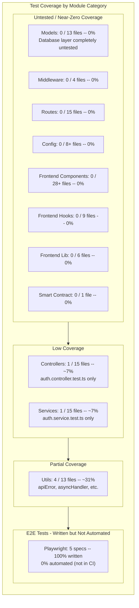

## K-01: Test Coverage Gap Map

Test coverage gap map across all module categories showing file counts, tested file counts, coverage percentages, and critical observations.

Coverage matrix showing critical gaps across all tiers. Only 6 of 127+ files have tests (~5%). The database layer (13 models), all frontend components (28+), middleware (4), routes (15), and the smart contract (1) have zero tests. Utils lead at ~31%. All 5 Playwright E2E specs exist but none run in CI, creating a gap between development and deployment verification.
