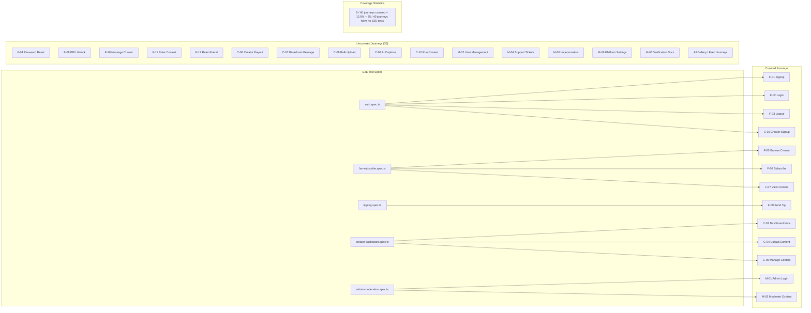

## K-02: End-to-End Test Journey Coverage

Mapping of 5 Playwright E2E test specs against 40 user journeys, showing covered and uncovered journeys plus aggregate coverage statistics.

Five E2E specs cover only 13 of 40 user journeys (12.5%). `auth.spec.ts` covers auth journeys (F-01–F-03, C-01). `fan-subscribe.spec.ts` covers browse/subscribe/view (F-05–F-07). `tipping.spec.ts` covers send tip (F-09). `creator-dashboard.spec.ts` covers creator journeys (C-03–C-05). `admin-moderation.spec.ts` covers admin journeys (M-01, M-03). Thirty-five journeys — including password reset, PPV unlock, creator payout, bulk upload, impersonation, and all gallery/feed journeys — have no E2E test coverage.
