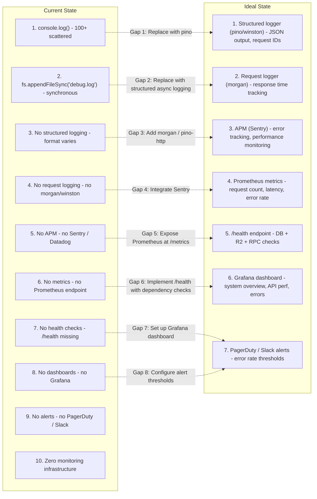

## K-03: Monitoring & Observability Gap Diagram

Side-by-side comparison of the current monitoring state versus the ideal observability stack, with gap annotations linking each deficiency to a recommended remediation.

Paired comparison reveals 10 gaps in the current observability stack versus 7 ideal components. Current state relies on ad-hoc `console.log` and synchronous file logging with no structured logging, APM, metrics, health checks, dashboards, or alerts. The ideal state proposes pino/winston for structured logging, Sentry for APM, Prometheus for metrics, a `/health` endpoint with dependency checks, a Grafana dashboard, and PagerDuty/Slack alerting. Gaps 7 and 8 both feed into the same ideal target (alerting infrastructure).
