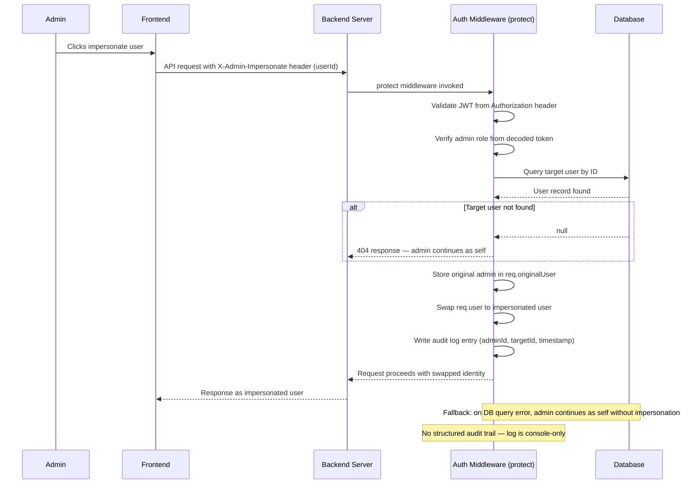

## B-07: Admin Impersonation Internal Flow

Server-side impersonation header processing within the `protect` middleware — shows JWT validation, role check, user swap, audit log write, and failure paths.

Shows the 5-step impersonation flow inside the `protect` middleware: JWT validation, role check, target user lookup, identity swap with `req.originalUser`, and audit log write. Annotations note the 404 fallback and the missing structured audit trail.
