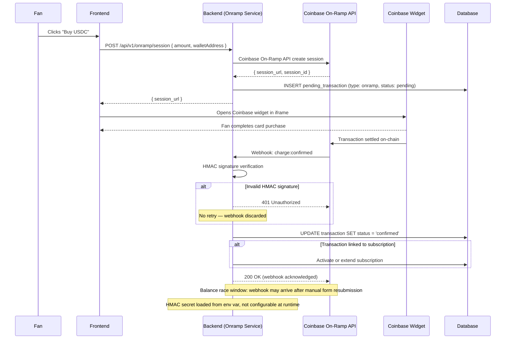

## C-09: Fiat-to-Crypto On-Ramp Flow

Complete Coinbase On-Ramp lifecycle — fan purchases USDC via card, from session creation through webhook confirmation and subscription activation.

Shows the complete Coinbase On-Ramp lifecycle from the fan clicking "Buy USDC" through session creation, widget interaction, webhook callback with HMAC verification, transaction status update, and conditional subscription activation. Annotations note the HMAC failure path and the balance race window.
