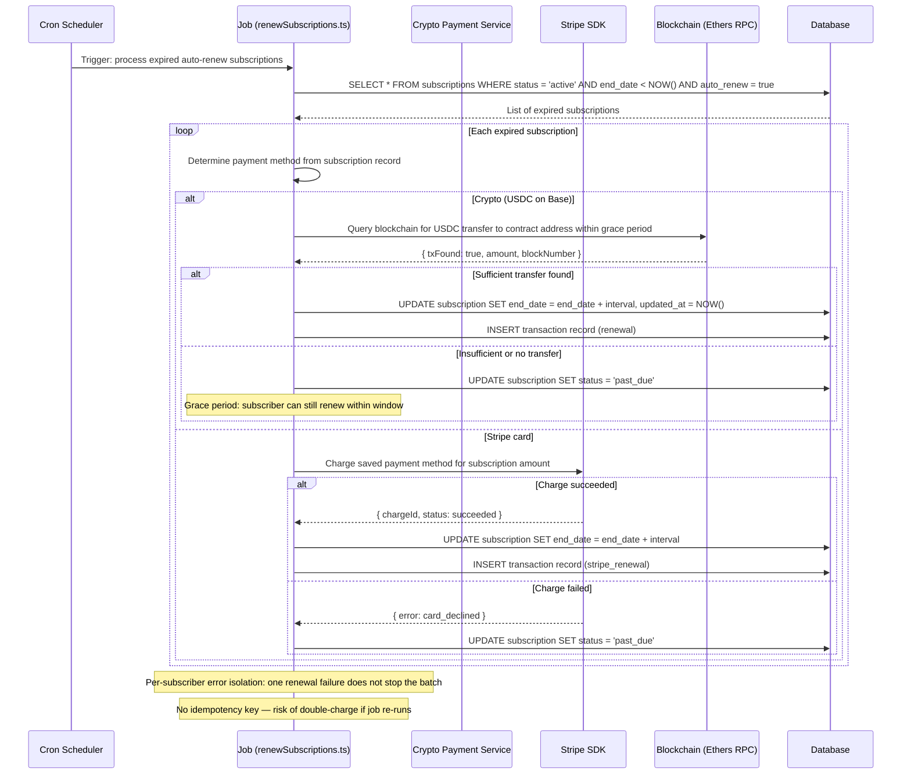

## C-10: Subscription Renewal Batch Processing

Scheduled batch job that processes expired auto-renew subscriptions — queries expired records, determines payment method (crypto vs stripe), attempts renewal, and handles success/failure per subscriber.

Shows the scheduled batch renewal job querying expired auto-renew subscriptions, branching on crypto-vs-stripe payment method, attempting the renewal on-chain or via Stripe charge, and updating the subscription status on success or failure. Annotations note the per-subscriber isolation, grace period, and missing idempotency key.
