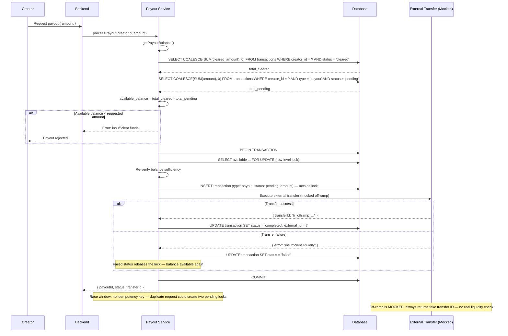

## C-11: Payout Balance Lock Flow

Concurrent payout lock mechanism — shows the balance computation, DB-level locking with `FOR UPDATE`, pending payout record as mutex, external transfer, and the race window without idempotency.

Shows the payout balance lock flow with DB-level locking (`FOR UPDATE`), the pending payout record serving as a mutex, the mocked off-ramp external transfer, and the commitment/rollback paths. Annotations flag the missing idempotency key and the mocked off-ramp.
