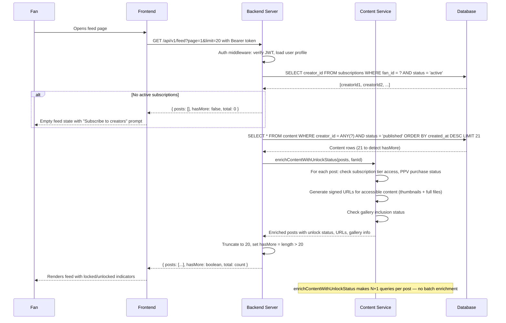

## D-09: Fan Feed Generation Pipeline

Fan requests their personalized feed — shows auth, subscription query, content fetch with pagination, enrichment with unlock status and signed URLs, and the empty-feed edge case.

Shows the fan feed generation pipeline from request through auth, subscription discovery, paginated content query, enrichment with unlock status and signed URLs, and the empty-feed edge case when the fan has no active subscriptions. Annotations note the N+1 query pattern in enrichment.
