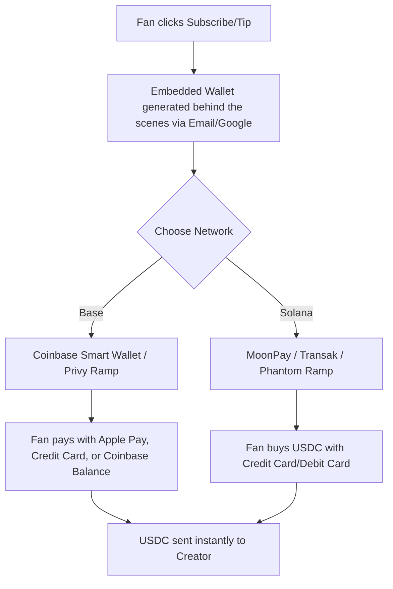
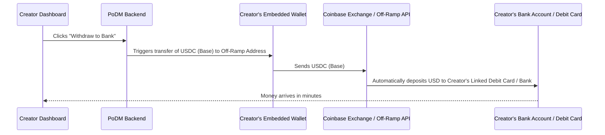

# Base vs. Solana: Blockchain Selection for PoDM

Choosing between **Base** (Coinbase's Layer 2 network on Ethereum) and **Solana** is a critical decision that will dictate the payment experience, transaction costs, and—most importantly—how easily creators can cash out their earnings to real bank accounts.

---

## 1. High-Level Comparison Table

| Feature | Base (Coinbase's L2) | Solana (Independent Layer 1) |
| :--- | :--- | :--- |
| **Transaction Fee (Gas)** | ~$0.01 - $0.05 | < $0.001 (fraction of a cent) |
| **Transaction Speed** | ~2 seconds (extremely fast) | < 1 second (near-instant) |
| **USDC Integration** | Native (Issued directly by Circle) | Native (Issued directly by Circle) |
| **Fiat Off-Ramp (Cash Out)** | **Exceptional** (Direct integration with Coinbase exchange, debit cards, and bank rails) | **Good** (Integrated via third-party off-ramps like MoonPay or Phantom Cash-Out) |
| **Onboarding Friction** | Low (Coinbase Smart Wallet lets fans pay with Apple Pay / Coinbase accounts) | Low (Phantom/Backpack wallets, but requires web3-specific setups for advanced features) |

---

## 2. The Fan Experience: How They Pay

With **Embedded Wallets** (Privy/Web3Auth), the technical complexity is hidden. Here is how fans interact with each network:



### On Base (The Coinbase Advantage)
Because Base is built by Coinbase, the onboarding rails are unmatched for mainstream audiences:
* **Coinbase Smart Wallet:** Fans can log in using their phone’s FaceID/Passkey.
* **Funding:** Fans can pay directly using their existing Coinbase exchange balance, a linked bank account, or **Apple Pay / Google Pay** via Coinbase Pay.
* **Experience:** Extremely polished and feels identical to a traditional checkout flow.

### On Solana (The High-Performance Speedster)
Solana is incredibly fast, but funding is more reliant on third-party processors:
* **Funding:** Fans buy Solana-based USDC using credit card ramps like **MoonPay**, **Transak**, or **Stripe Crypto Ramp**.
* **Experience:** Very fast, but credit card purchase minimums (often $10–$15) can sometimes be a barrier for tiny $3–$5 fan tips.

---

## 3. The Creator Experience & The "Easy Cash-Out" Flow

For creators with **zero crypto experience**, the platform must offer a simple "Withdraw to Bank" button. 

Here is how each network handles cashing out USDC to local currencies (USD, EUR, GBP):

### A. The Base Off-Ramp Workflow (Smoothest & Cheapest)
Because Base runs natively alongside Coinbase, we can provide an almost-instant cash-out flow:



* **Debit Card Cash-outs:** Using Coinbase's Developer Off-Ramp API, creators can link a debit card and cash out instantly. The funds arrive in their bank account in minutes for a tiny fee (typically 1-1.5%).
* **Bank Transfers (ACH/SEPA):** Creators can connect their bank account, convert USDC to fiat, and withdraw directly to their bank.
* **Low Gas Fees:** The creator pays almost nothing ($0.01) to move their money to the cash-out contract.

### B. The Solana Off-Ramp Workflow (Fast but External)
On Solana, since Coinbase doesn't operate the network natively, we rely on independent gateways:
* **Third-Party Off-Ramps:** We integrate tools like **MoonPay Off-Ramp** or **Bridge.xyz** directly into the creator dashboard.
* **The Flow:** The creator clicks "Withdraw," the dashboard sends the Solana USDC to the gateway, and the gateway initiates a wire or ACH transfer to the creator's bank.
* **Fees:** Independent off-ramps sometimes charge higher minimum transaction fees (e.g., $1.99 minimum) compared to Coinbase's direct network integrations.

---

## 4. The Verdict for PoDM

> [!TIP]
> **Base is the highly recommended choice for PoDM.**
> 
> While Solana is technically faster by a fraction of a second, **Base has a massive business advantage** because it is built by Coinbase. 
> Since your target users (both creators and fans) are non-technical, the ability to seamlessly connect to Coinbase balances, pay with Apple Pay, and offer low-cost, instant debit card cash-outs makes Base the superior choice for mainstream adoption.

---

## 5. Hybrid Wallet Model: Custom Payout Addresses

To accommodate both non-technical creators and advanced crypto users, we can implement a **Hybrid Wallet Model**:

```mermaid
graph TD
    A[Creator Dashboard] --> B{Wallet Preference}
    B -- Non-Crypto User --> C[Embedded System Wallet]
    B -- Crypto-Native User --> D[Custom Payout Address]
    C --> E[Easy "Withdraw to Bank" via Platform Off-Ramp]
    D --> F[Direct Blockchain Routing to Creator's Own Wallet]
    F --> G[Creator is 100% responsible for their own cash-out]
```

### How Custom Payout Addresses Work
1. **The Choice:** During onboarding or in their settings, creators can select:
   * *"Create an automatic payout wallet for me (Easiest)"*
   * *"Send my payments to my own custom wallet address (Advanced)"*
2. **Direct Payouts:** If they choose a custom address, our smart contract or payment backend routes all their subscription and tipping revenues directly to that external address (e.g., their ledger or cold wallet) in real-time.

### Division of Responsibility
* **Zero Platform Intervention:** Once the blockchain transfers the USDC to their custom wallet address, the transaction is finalized. The platform does not hold their funds, cannot retrieve them, and has no control over them.
* **Creator Responsibility:** The creator is fully responsible for:
  * Securing their wallet's private keys and seed phrases.
  * Paying the network gas fees to transfer their funds out.
  * Initiating and managing their own cash-outs to a real-world bank account via their preferred crypto exchange (e.g., Binance, Coinbase, Kraken).
* **Significant Business Benefit for You:** This is highly advantageous for PoDM. It reduces your platform's regulatory compliance and custody burden because you are not touch-handling these creators' funds; you are simply acting as an automated routing system directly to their designated address.

---

## Next Decisions to Move Forward

If you are aligned with **Base** as the blockchain, **USDC** as the payment method, and a **Hybrid Wallet Model**, we can start designing the implementation plan:

1. **Would you like to see a frontend mockup of what the Fan checkout flow and the Creator "Withdraw" page would look like?**
2. **Are there any other specific cash-out options (like local bank transfer methods for different countries) you want to ensure we support?**
