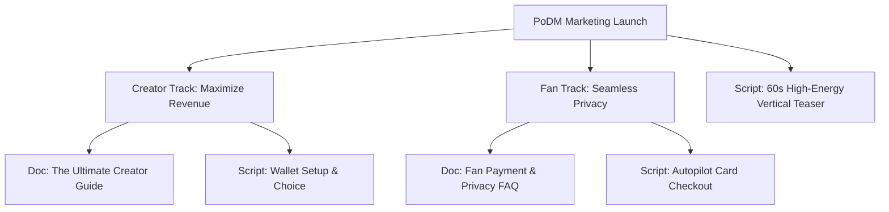

# Implementation Plan: PoDM Onboarding Docs & Marketable Video Scripts

This implementation plan details the strategy, outlines, and script tracks to build a comprehensive suite of intro documents and marketing/walkthrough video scripts. 

Our goal is to introduce PoDM to two distinct audiences—**Creators** and **Fans**—by explaining our 100% pure Web3 USDC payments architecture, zero-chargebacks protection, and autopilot credit card checkout experience in a highly engaging, informative, and marketable format.

---

## 🎯 Onboarding & Marketing Roadmap

### 1. The Creator Track (Focus: Sovereignty & Profit)
* **The Pitch:** "Own your content. Keep 100% of your cleared earnings. Safe from credit card chargebacks and processor bans."
* **Intro Doc:** *The Ultimate Creator's Guide to PoDM*. Covers setting up a wallet, configuring Base Sepolia sandbox testing, choosing a settlement ecosystem (Base L2 default vs. Monad/MegaETH L1), setting subscription tier pricing, and cashing out directly via Apple Pay/Debit card.
* **Video Script:** *How to Configure Payouts & Subscriptions in 2 Minutes*. A fast-paced screen walkthrough showcasing the settings panel and direct wallet withdrawals.

### 2. The Fan Track (Focus: Privacy & Ease)
* **The Pitch:** "Support your favorite creators instantly. Set-and-forget autopilot card billing. 100% private embedded accounts."
* **Intro Doc:** *Fan FAQ: Privacy, Embedded Wallets, and Credit Card Autopilot*. Covers how email registration instantly generates a secure Privy embedded wallet, how standard credit cards auto-buy USDC via fiat on-ramps, and how monthly subscriptions charge automatically without wallet top-ups.
* **Video Script:** *Subscribing on Autopilot: The Ultimate Web3 Checkout Experience*. A clear, reassuring animation script demonstrating Privy logins and credit card swaps.

### 3. The Vertical Video Track (Focus: Hype & Conversion)
* **The Pitch:** Highly marketable, fast-cut teaser targeting TikTok, YouTube Shorts, and Instagram Reels to capture creator traffic from platforms like Instagram and Linktree.
* **Video Script:** *Why Web2 Platforms are Robbing Creators (and How PoDM Fixes It)*. Emphasizes the pain of Stripe account bans and card chargebacks versus the freedom of Base L2 USDC.

---

## 🔎 Open Questions for Strategic Alignment

> [!IMPORTANT]
> To ensure the documents and scripts are tailored exactly to your vision, please share your thoughts on the following items:
> 
> **1. Hype-Driven vs. Educational Tone:**
> * *Hype-Driven:* Bold, disruptive, anti-middleman language. ("Take back your sovereignty. Banks are dead. The Monad/Base Creator Revolution is here.")
> * *Educational & Premium:* Sleek, secure, and intuitive focus. ("The next-generation content platform. Built for safety, seamless compliance, and zero processing friction.")
> * *Which voice do you prefer to lead with?*
> 
> **2. Target Video Platforms & Formatting:**
> * Would you like us to optimize the scripts for vertical fast-cut video (vertical orientation, camera directions, text overlays, and hook-centric vertical scripting) or horizontal widescreen walk-throughs (steady narration, product cursor highlights, and long-form pacing)?
> 
> **3. Brand Taglines & Hooks:**
> * Are there specific branding taglines you would like incorporated? E.g., *"Earnings on Autopilot,"* *"Immutable Sovereignty,"* or *"The Web3 OnlyFans for Base, Monad, and MegaETH."*

---

## 📋 Execution Plan (Next Steps Upon Approval)
1. **Dismantle & Structure Plan:** Receive your answers and explicit approval.
2. **Draft Onboarding Guides:** Write `creator_onboarding_guide.md` and `fan_payment_faq.md` in the brain artifacts folder.
3. **Draft High-Fidelity Scripts:** Write three full-length video scripts with narration, visual cues, sound effects (SFX), and text overlay directions.
4. **Final Presentation:** Walk you through the complete creative suite.
