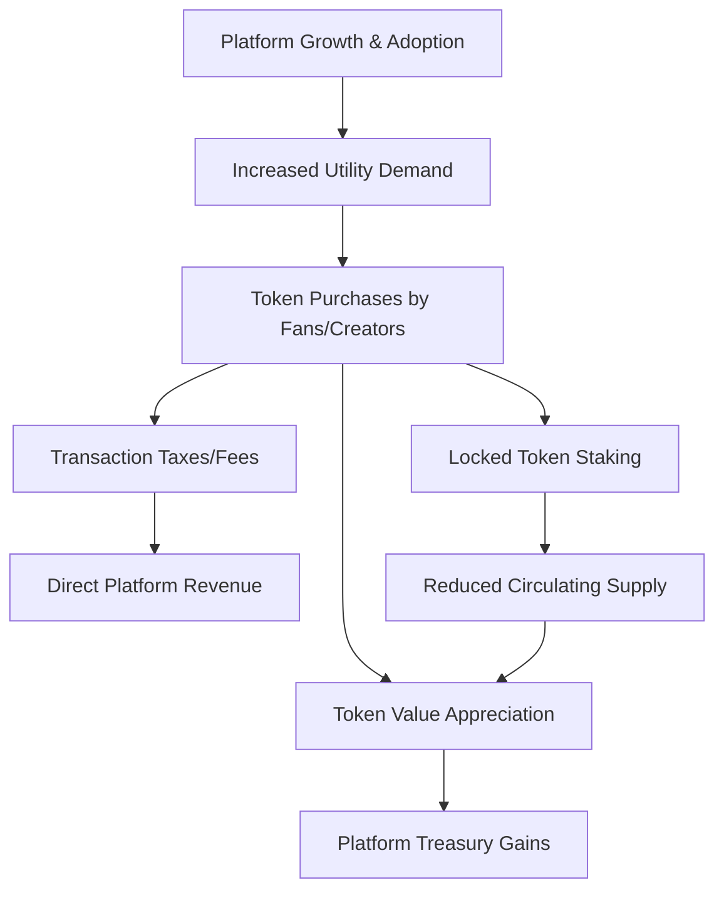
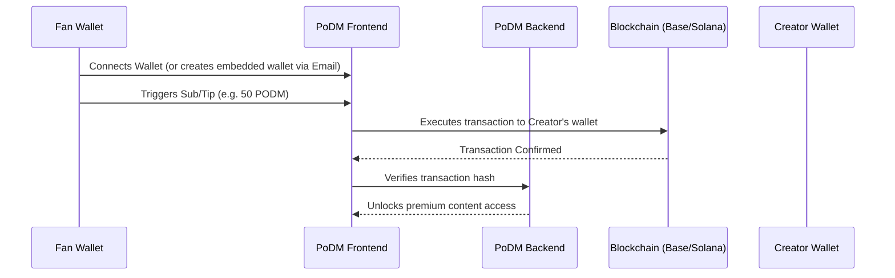

# Integrating Crypto into PoDM: An Educational & Strategic Guide

This guide is designed to introduce you to the fundamentals of cryptocurrency, explain how tokens generate value and revenue, and outline how a custom **PODM Token** can be integrated into the PoDM platform to solve major business challenges, lower operational costs, and align incentives between creators, fans, and the platform.

---

## 1. Crypto 101: How Coins & Tokens Work (Plain English)

To understand how a cryptocurrency would fit into PoDM, it helps to start with the foundational concepts.

### Blockchain: The Public Ledger
Imagine a shared Google Sheet that records transactions (e.g., "User A sent 10 tokens to Creator B").
* **Decentralized:** Instead of being hosted on a single server owned by a bank or Google, this ledger is copied across thousands of computers globally.
* **Immutable:** Once a transaction is written, it cannot be edited, deleted, or forged. This creates trust without requiring a middleman (like a bank or Stripe).

### Coins vs. Tokens
People often use these words interchangeably, but they are technically different:
1. **Coins (Native Currencies):** These are native to their own blockchain. They are used to pay for the computation power (gas fees) required to run the network. Examples: **Ether (ETH)** on Ethereum, **SOL** on Solana.
2. **Tokens (Application Currencies):** These are built *on top* of an existing blockchain using smart contracts. They don't have their own blockchain; instead, they inherit the security and speed of an existing one. Examples: **USDC** (a stablecoin), or a custom **PODM** token.

> [!IMPORTANT]
> **For PoDM, you should create a TOKEN, not a COIN.**
> Building a new blockchain (a "coin") is extremely expensive, technically complex, and unnecessary. Building a "token" on an established network (like **Base** or **Solana**) takes less than an hour and costs pennies.

### Smart Contracts: The Automated Rules
A smart contract is a self-executing contract where the agreement terms are written directly into lines of code. For a PODM token, the smart contract governs:
* The total supply of tokens (e.g., 100,000,000 PODM).
* How tokens are transferred.
* Special features, like automatic staking rewards or fee discounts.

---

## 2. How Crypto Tokens "Make Money"

Crypto assets generate revenue and value through a combination of economics, utility, and market dynamics:

### A. Token Appreciation (The Treasury Model)
When you launch the PODM token, you define the total supply. The platform (you) keeps a portion of this supply in a "Treasury" (e.g., 30% of all tokens).
* As PoDM grows, more fans and creators need the token to participate in the platform's ecosystem.
* Since the supply is fixed and demand increases, the value of each token goes up.
* The tokens remaining in your treasury become highly valuable, which you can use to fund operations, pay developers, or reward active creators.

### B. Eliminating Payment Fees (Direct Savings)
Traditional payment networks (like Visa, Mastercard, and Stripe) charge substantial fees:
* **Stripe Standard:** ~2.9% + $0.30 per transaction.
* **High-Risk Industries (such as creator platforms):** Fees can often go up to **5% to 15%**, or platforms face outright account bans.
* **Crypto Transactions:** Cost a fraction of a cent (on modern L2 networks) paid by the user. By migrating transactions to a PODM token, the platform saves millions of dollars in payment processing costs annually.

### C. Peer-to-Peer Transaction Fees (Taxes)
You can code a small fee (e.g., 0.5% or 1%) into the token transfer smart contract. Every time a fan tips a creator or trades PODM tokens on a decentralized exchange, a tiny percentage is automatically routed back to the platform treasury.

### D. Liquidity Provision & Yield
By creating a "liquidity pool" on a decentralized exchange (like Uniswap or Raydium) where users trade cash (USDC) for PODM, the platform earns trading fees whenever people buy or sell the token.

---

## 3. What Could a "PODM Token" Be Used For?

Integrating a token into PoDM provides powerful features that traditional currencies (USD) cannot support.

### A. Frictionless Subscriptions and Tips
Fans buy PODM tokens and use them to purchase subscriptions, unlock private profiles, or send Pay-Per-View (PPV) messages. Creators receive PODM instantly.

### B. Staking for Platform Benefits
*Staking* means locking up tokens in a smart contract for a set period. In return, the user gets benefits:
* **For Fans:** Staking 1,000 PODM unlocks premium badges, early-access content, or exclusive platform features.
* **For Creators:** Staking 10,000 PODM lowers the platform's commission fee (e.g., instead of the platform taking a 10% fee, staking drops the fee to 5%). This encourages creators to buy and hold the token, taking it out of circulation and increasing price stability.

### C. Zero Chargeback Risk (Uncapped Security)
Chargeback fraud (a fan buys content, watches it, and then claims their card was stolen) is a massive threat to creator platforms. Payment processors will ban platforms with high chargeback rates.
* **Crypto is irreversible.** Once a fan sends PODM to a creator, they cannot "charge it back" through a bank. This protects your platform and your creators entirely from fraud.

### D. Automated Referral Program & Creator Incentives
Instead of paying cash bonuses out of your pocket:
* You can reward creators with PODM tokens for hitting milestone goals (e.g., "Refer 10 active creators and get 5,000 PODM").
* You can reward fans with PODM for referring new paying subscribers.
* This aligns everyone's interests: the more the platform grows, the more valuable their reward tokens become.

### E. Enclave Premium Memberships (NFTs)
Your premium creator tier, **The Enclave** (which locks in a 10% fee for life), could be represented by a unique NFT (Non-Fungible Token). 
* Only 50 Enclave NFTs will ever exist.
* Creators can buy, sell, or trade their Enclave membership spot on the open market. If a creator retires, they can sell their Enclave NFT to another creator, and the platform can collect a royalty fee on that resale.

---

## 4. How Does This Help You (The Platform Owner)?

Implementing a PODM token shifts your business model from a simple middleman charging a fee to a fully-aligned financial ecosystem:

| Traditional Web2 Platform (e.g., OnlyFans) | Web3 Enabled Platform (PoDM with Tokens) |
| :--- | :--- |
| **Payment Risk:** High risk of Stripe bans or credit card processor censorship. | **Censorship Resistant:** Independent of traditional banking rails; transactions cannot be blocked. |
| **High Costs:** 3% - 10% lost to credit card fees and chargeback fraud. | **Near-Zero Fees:** High-speed blockchain fees cost less than $0.01. Zero chargebacks. |
| **Cash Burn:** Must pay fiat cash to market and grow via referral bonuses. | **Token Incentives:** Rewards are paid in PODM from the treasury, conserving cash reserves. |
| **One-Way Retention:** Users leave easily if competitor fees are lower. | **Community Ownership:** Creators and fans holding tokens are active stakeholders in your success. |

---

## 5. The Practical Roadmap to Launching PODM Token

You don't need to build a complex system from day one. Here is a realistic, step-by-step path to adding crypto to the existing PoDM stack:

### Phase 1: Support Stablecoins First (Low Risk)
Before creating a custom token, update the backend (`PoDM_project`) and frontend (`podm-frontend`) to accept **USDC** (a stablecoin pegged to $1 USD) on a cheap network like **Base** (Coinbase's Layer 2 network) or **Solana**.
* **Why:** You learn how to build the crypto payment flow, and creators get stable dollars without worrying about price volatility.

### Phase 2: Launch the PODM Utility Token
Once the stablecoin flow works, write and deploy a simple smart contract for the **PODM Token** (using the ERC-20 standard).
* Distribute tokens to your treasury, team, and early creators.
* Enable PODM as a payment option on the site (often offering a 5-10% discount for paying in PODM to drive adoption).

### Phase 3: Web3-to-Web2 "Embedded Wallets" (Crucial for Adoption)
Most fans do not have a MetaMask crypto wallet. To solve this onboarding hurdle:
* Use a service like **Privy**, **Web3Auth**, or **Coinbase Smart Wallet**.
* When a user signs up on PoDM with their email or Google account, a crypto wallet is automatically created for them in the background.
* Integrate a fiat ramp (like **MoonPay** or **Transak**). Fans can type in their credit card, buy PODM/USDC instantly inside your checkout flow, and complete their purchase without ever leaving the website.

---

## 6. Critical Risks to Keep in Mind

While crypto offers massive opportunities, you must navigate key challenges carefully:

> [!WARNING]
> **1. Regulatory & Legal Risk:**
> If you sell a token by promising buyers that they will make a profit because of your efforts, the SEC may classify it as an "unregistered security." To prevent this, the PODM token should be marketed and structured purely as a **utility token**—meaning it is a voucher used to buy services, get discounts, and participate in platform features, not a speculative investment. Consult a web3 legal expert before launching a public token sale.

> [!WARNING]
> **2. Volatility Management:**
> Creators have bills to pay in real-world currency (USD, EUR). If the price of PODM fluctuates wildly, creators will get nervous. You must provide an easy, automated way for creators to swap their earned PODM into USDC or withdraw it directly to bank accounts.

---

## Next Steps for Discussion

If you'd like to pursue this, we can discuss:
1. Which blockchain network would be the best fit for your user base (e.g., **Base** due to Coinbase integrations, or **Solana** due to cheap and fast transactions)?
2. How to integrate an embedded wallet system into your current React frontend (`podm-frontend`) so non-crypto users can participate easily.
3. How to design a prototype in a test environment (a "Testnet") to try out the payments without using real money.
