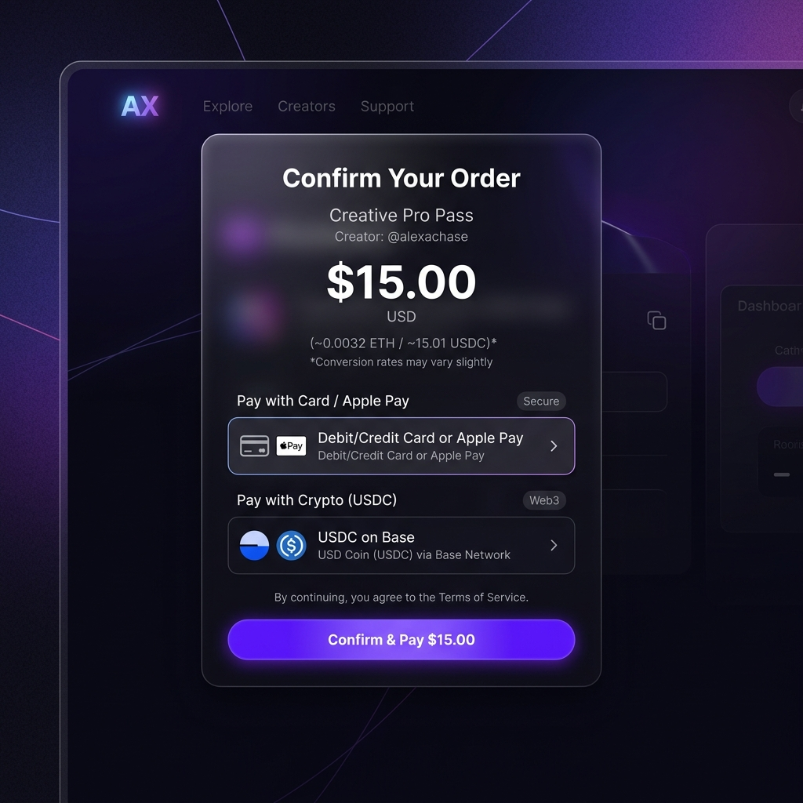
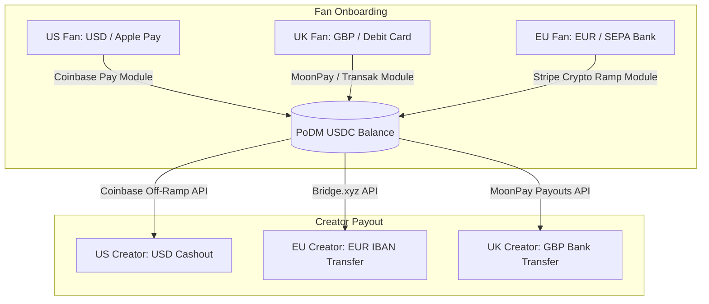

# PoDM Premium Crypto UI Mockups & Modular Architecture

This document presents the premium, high-fidelity UI/UX mockups for the crypto integration, alongside the technical layout for a highly modular, international-ready payment architecture.

---

## 1. Premium UI/UX Mockups

The following carousel displays our vision for the checkout and withdrawal screens. We've utilized best practices in modern web design (sleek dark mode, premium glassmorphism, glowing colorful accents, and minimal crypto jargon) to ensure fans and creators have an identical experience to a top-tier Web2 application.

````carousel

<!-- slide -->

````

---

## 2. Modular International Architecture

To support your vision of starting with US creators while remaining fully open to global funds, we will implement a **Modular Gateway Architecture**. 

Instead of locking our system into one specific payment processor, the PoDM ledger will operate purely in **USDC on Base** internally. We then treat fiat deposit methods (Fans) and bank payout methods (Creators) as **plug-and-play modules**.



### A. The Fan Deposit Modules (Plugging in Global Currencies)
Our checkout form is designed to dynamically load the best local fiat-to-crypto provider based on the fan's geographical location:
* **For US Fans (Default):** We load the **Coinbase Pay** module. Fans can purchase USDC instantly using their US bank accounts, debit cards, Apple Pay, or existing Coinbase balances.
* **For UK & EU Fans:** When the system detects a European IP or payment card, it seamlessly swaps the provider to **Transak** or **MoonPay**. The fan types in their Euro/GBP card or uses local instant bank transfers (like Faster Payments in the UK or SEPA in Europe) to complete the purchase.
* **Expanding Internationally:** If we onboard fans from Latin America, Asia, or Africa later, we can plug in dedicated local gateways (such as Yellow Card for Africa or Pix-to-Crypto for Brazil) without altering a single line of our core subscription code.

### B. The Creator Withdrawal Modules (Cashing Out Internationally)
Similarly, the Creator Dashboard connects to a variety of payout networks under the hood:
* **US Creators (Phase 1):** The "Withdraw to Debit Card" button connects to the **Coinbase Off-Ramp API**, converting USDC directly to US Dollars on their linked debit cards or bank accounts.
* **UK/EU Creators (Phase 2):** We plug in a provider like **Bridge.xyz** or **MoonPay Payouts**. Creators can withdraw their USDC directly as Euros (SEPA) or Pounds (Faster Payments) into their European bank accounts.
* **High-Volume Creators:** We can add a direct wire/ACH integration to institutional liquidity providers for creators making substantial monthly revenues.

---

## Next Steps for Review

1. **How do you feel about the visual aesthetic of the mockups?** Does the glassmorphic dark-mode design look premium enough for the PoDM platform?
2. **Would you like us to start outlining the database schema changes** in the backend (`PoDM_project`) to support these transaction records and the creator hybrid wallet settings?
