# Deliverable 6: State Transition Coverage

**Project**: PoDM Creator-Audience Platform  
**Date**: August 9, 2026  
**Scope**: 11 state machines — all grounded in live code from models, services, routes, and smart contract

---

## Index

| # | State Machine | States | Critical Gaps |
|---|---|---|---|
| 1 | [Transaction Verification](#1-transaction-verification) | `Pending` → `Cleared` / `Failed` / `Refunded` | PAY-002 through PAY-017 all untested |
| 2 | [Subscription Lifecycle](#2-subscription-lifecycle) | `active` → `canceled` / `expired` + renewal | SUB-003, SUB-005, SUB-006 untested |
| 3 | [Content Moderation](#3-content-moderation) | `scheduled` → `published` → `flagged` | CON-011 auto-flag untested |
| 4 | [Content Report](#4-content-report) | `pending` → `dismissed` | CON-010, CON-012 untested |
| 5 | [Contest](#5-contest-lifecycle) | `draft` → `active` → `completed` | All CNT-* untested |
| 6 | [User / Creator Account Status](#6-user--creator-account-status) | `pending verification` → `active` / `suspended` | AUTH-005, AUTH-015 untested |
| 7 | [Smart Contract Recurring Allowance](#7-smart-contract-recurring-allowance) | none → `active` → `revoked` | All SOL-* untested |
| 8 | [Notification Read State](#8-notification-read-state) | `unread` → `read` / `deleted` | NOT-003 through NOT-005 untested |
| 9 | [Referral — PERCENT Path](#9-referral--percent-path) | `applied` → `active` → `expired` | REF-001, REF-005 untested |
| 10 | [Referral — CASH Path](#10-referral--cash-path) | `tracking` → `milestone_reached` / `expired` | REF-006, REF-007, REF-008 untested |
| 11 | [Message Content Unlock](#11-message-content-unlock) | `locked` → `unlocked` | MSG-009, MSG-010 untested |

---

## 1. Transaction Verification

### States
| State | Value | Description |
|---|---|---|
| `Pending` | `'Pending'` | Transaction created; on-chain confirmation not yet verified |
| `Cleared` | `'Cleared'` | On-chain receipt found and all validation checks passed |
| `Failed` | `'Failed'` | Verification could not confirm on-chain; not recoverable |
| `Refunded` | `'Refunded'` | Administrative refund applied post-settlement |

### State Diagram

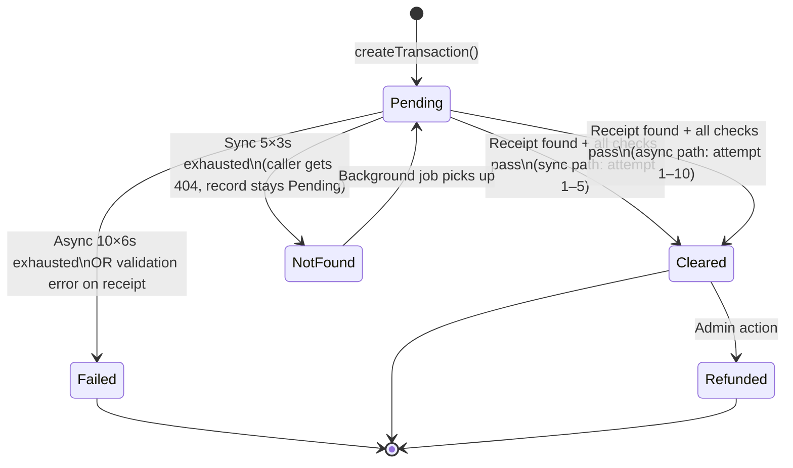

### Sync Verification Path (foreground, user-facing)
```
MAX_ATTEMPTS = 5 | DELAY = 3000ms
For each attempt:
  1. eth_getTransactionReceipt(txHash)
  2. If null → sleep(DELAY) → retry
  3. If receipt:
     a. receipt.status === '0x0'     → throw 400 "Transaction failed on the blockchain"
     b. Check contract address in logs → throw 400 "Interacted target is not the PoDM smart contract"
     c. ERC-4337: receipt.to may = EntryPoint; valid if logs contain PoDM contract
     d. Decode topics[2] → creator wallet match → throw 400 "Transaction recipient does not match"
     e. Amount ±1 cent tolerance → throw 400 "Transaction amount mismatch"
     f. Referrer present when no active referral → throw 400 "unexpected referrer"
     g. Referrer wallet mismatch → throw 400 "Transaction referrer does not match"
     h. Referral fee ±2 cent tolerance → throw 400 "Referral fee mismatch"
     i. All pass → updateTransactionStatus(txHash, 'Cleared') → return 200
After 5 attempts with null: return 404 (record stays Pending; background job takes over)
```

### Async Verification Path (background job)
```
MAX_ATTEMPTS = 10 | DELAY = 6000ms
Same validation logic as sync path
After 10 attempts with null: updateTransactionStatus(txHash, 'Failed')
```

### Transition Table

| From | To | Trigger | Guard | Side Effect |
|---|---|---|---|---|
| *(start)* | `Pending` | `createTransaction(data)` | None | DB row inserted |
| `Pending` | `Cleared` | Receipt found + validated (sync or async) | All 8 validation checks pass | `updateTransactionStatus(txHash, 'Cleared')`; `incrementContentPpvEarningsStats` or `incrementContentTipStats` called (if PPV/Tip type) |
| `Pending` | `Failed` | Async 10×6s exhausted OR validation error | `status === '0x0'`, wrong contract, wrong recipient, amount mismatch, referrer mismatch, or fee mismatch | `updateTransactionStatus(txHash, 'Failed')` |
| `Pending` | `Pending` (stays) | Sync 5×3s exhausted, no receipt | — | 404 returned to caller; background async job begins |
| `Cleared` | `Refunded` | Admin action | Admin role | `updateTransactionStatus(txHash, 'Refunded')` |

### Duplicate Hash Guard
```
Before createTransaction: findTransactionByBlockchainTxHash(txHash)
If found → 409 "This transaction hash has already been verified"
Prevents re-processing the same on-chain tx
```

### Test Coverage Gaps (mapped to D4)

| Gap | D4 Scenario | Risk |
|---|---|---|
| Duplicate tx hash re-submission | PAY-002 ⬜ | **Critical** — double-credit attack vector |
| No receipt after sync 5 retries | PAY-004 ⬜ | High |
| On-chain reverted tx (`status=0x0`) | PAY-005 ⬜ | High |
| Wrong contract in logs | PAY-006 ⬜ | High |
| Wrong creator wallet | PAY-007 ⬜ | **Critical** — payment to wrong creator |
| Amount mismatch > 1 cent | PAY-008 ⬜ | High |
| Unexpected referrer | PAY-009 ⬜ | High |
| Referrer wallet mismatch | PAY-010 ⬜ | High |
| Referral fee mismatch > 2 cents | PAY-011 ⬜ | High |
| Async background → Failed after 10 retries | PAY-012 ⬜ | High |
| ERC-4337 UserOp (receipt.to = EntryPoint) | PAY-013 ⬜ | High — gasless txs silently rejected without this fix |

---

## 2. Subscription Lifecycle

### States
| State | Value | Description |
|---|---|---|
| `active` | `'active'` | Fan is subscribed; content access granted |
| `canceled` | `'canceled'` | Fan canceled; access until period end |
| `expired` | `'expired'` | Period ended without renewal or cancel-at-end reached |

### State Diagram

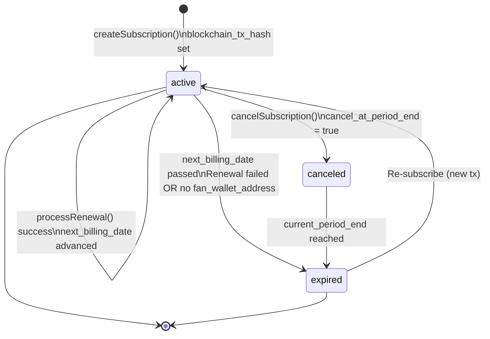

### Renewal Eligibility Check
```typescript
findSubscriptionsDueForRenewal():
  WHERE status = 'active'
  AND next_billing_date <= NOW()
  AND fan_wallet_address IS NOT NULL   ← wallet required for on-chain keeper call
```

### Transition Table

| From | To | Trigger | Guard | Side Effect |
|---|---|---|---|---|
| *(start)* | `active` | `createSubscription()` after tx `Cleared` | Valid cleared `blockchain_tx_hash` | `subscriptions` row inserted; `notifySubscribersOfNewContent` enabled |
| `active` | `active` | `processRenewal()` by keeper wallet on-chain | `allowance.active && amount <= maxAmountPerPeriod && block.timestamp >= lastRenewalAt + periodInSeconds` | `lastRenewalAt = block.timestamp`; `next_billing_date` advanced; `SubscriptionRenewed` event emitted |
| `active` | `canceled` | Fan calls `cancelSubscription()` | Fan owns subscription | `cancel_at_period_end = true`; no immediate access revocation |
| `active` | `expired` | Renewal failure or no wallet | `next_billing_date <= NOW()` but wallet missing or `processRenewal` fails | `status = 'expired'`; content access revoked |
| `canceled` | `expired` | `current_period_end` timestamp reached | — | `status = 'expired'` |
| `expired` | `active` | New subscription payment cleared | New cleared tx | New `subscriptions` row; new `blockchain_tx_hash` |

### Key Columns
| Column | Purpose |
|---|---|
| `status` | `active` / `canceled` / `expired` |
| `next_billing_date` | Checked by renewal worker; must be ≤ NOW() |
| `cancel_at_period_end` | True = access until `current_period_end`, then expires |
| `fan_wallet_address` | Required for keeper to call `processRenewal`; NULL = auto-renewal blocked |
| `end_date` | Used for historical subscriber count queries |
| `blockchain_tx_hash` | Ties subscription to verified on-chain payment |

### Test Coverage Gaps

| Gap | D4 Scenario | Risk |
|---|---|---|
| `createSubscription` stores all required columns | SUB-003 ⬜ | High |
| `findSubscriptionsDueForRenewal` filters correctly (wallet + date) | SUB-005 ⬜ | High — wrong fans get auto-billed |
| Idempotency: re-use already-Cleared tx hash | SUB-006 ⬜ | Medium — duplicate subscription rows |
| `cancelSubscription` sets correct status | SUB-004 ⬜ | Medium |

---

## 3. Content Moderation

### States
| State | Value | Description |
|---|---|---|
| `scheduled` | `'scheduled'` | Created with `schedule.isScheduled = true`; not yet visible |
| `published` | `'published'` | Live and visible per visibility rules |
| `flagged` | `'flagged'` | Auto-flagged at 3+ reports; hidden from feed |
| *(deleted)* | — | Hard/soft delete by owner or admin |

### State Diagram

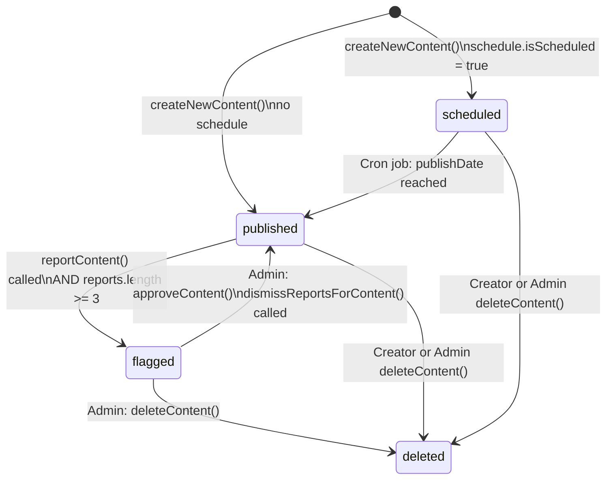

### Auto-Flag Logic
```typescript
// content.service.ts → reportContent()
const report = await ReportModel.createReport(userId, contentId, reason, details);
const reports = await ReportModel.getReportsByContentId(contentId);
if (reports && reports.length >= 3) {
    await ContentModel.updateContent(contentId, { status: 'flagged' });
}
```
> Threshold: **3 or more** reports on the same `content_id`. Each is an independent reporter.

### Transition Table

| From | To | Trigger | Guard | Side Effect |
|---|---|---|---|---|
| *(start)* | `published` | `createNewContent()` with no schedule | None | Files uploaded to R2; thumbnail generated (Sharp/FFmpeg); `notifySubscribersOfNewContent()` called |
| *(start)* | `scheduled` | `createNewContent()` with `isScheduled=true` | `publishDate` is future | Files uploaded; no notifications yet |
| `scheduled` | `published` | Cron job fires at `publishDate` | `schedule.publishDate <= NOW()` | `status = 'published'`; notifications sent |
| `published` | `flagged` | `reportContent()` and `reports.length >= 3` | Third distinct report on same `contentId` | `ContentModel.updateContent(id, { status: 'flagged' })` |
| `flagged` | `published` | Admin approves | `role === 'admin'` | `ContentModel.updateContent(id, { status: 'published' })`; `dismissReportsForContent()` sets all reports → `dismissed` |
| `published` | `deleted` | Creator or Admin delete | Ownership or admin role | Files deleted from R2; DB row removed |
| `flagged` | `deleted` | Admin delete | `role === 'admin'` | Same as above |

### Visibility Modifier (independent of status)
Content status controls existence; `visibility` controls access:
- `public` / `subscribers_only` / `pay_per_view` / `unlisted`
- These are orthogonal — a `flagged` post is still `pay_per_view`, it is just hidden from the feed.

### Test Coverage Gaps

| Gap | D4 Scenario | Risk |
|---|---|---|
| 3rd report triggers auto-flag | CON-011 ⬜ | **Critical** — moderation system core |
| 2nd report does NOT trigger flag | CON-011 ⬜ | High — boundary condition |
| Admin approve clears report rows | CON-012 ⬜ | Medium |
| Scheduled content publishes at correct time | *(no D4 scenario)* | Medium |

---

## 4. Content Report

### States
| State | Value | Description |
|---|---|---|
| `pending` | `'pending'` | Report submitted; awaiting admin review |
| `dismissed` | `'dismissed'` | Admin cleared the report (content approved or deleted) |

### State Diagram

```mermaid
stateDiagram-v2
    [*] --> pending : createReport()\nreporter_id, content_id, reason

    pending --> dismissed : Admin approveContent()\nOR Admin dismissContent()\ndismissReportsForContent() bulk-updates all rows for that content_id

    pending --> pending : Additional reports on same content\n(each is a new row; count checked in service)
```

### Transition Table

| From | To | Trigger | Guard | Side Effect |
|---|---|---|---|---|
| *(start)* | `pending` | `POST /content/:id/report` | `protect` (any auth user) | `content_reports` row inserted; report count checked → auto-flag if ≥ 3 |
| `pending` | `dismissed` | Admin approves or dismisses | `role === 'admin'` | `UPDATE content_reports SET status='dismissed' WHERE content_id = ?` (bulk) |

---

## 5. Contest Lifecycle

### States
| State | Value | Description |
|---|---|---|
| `draft` | `'draft'` | Created but not yet published; not visible to Audience |
| `active` | `'active'` | Published; Audience can enter |
| `completed` | `'completed'` | Winner picked; contest closed |

### State Diagram

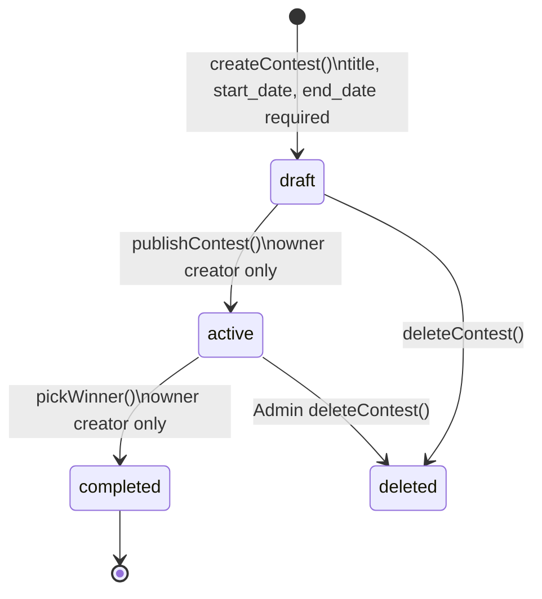

### Entry Guard (service layer)
```
enterContest():
  1. contest.status === 'active'         → else 400 "Contest is not active"
  2. new Date() <= contest.end_date      → else 400 "Contest has ended"
  3. fan has active subscription         → else 403 "must be a subscriber" (if required)
  4. fan not already entered             → else 409 (idempotency)
```

### Transition Table

| From | To | Trigger | Guard | Side Effect |
|---|---|---|---|---|
| *(start)* | `draft` | `POST /contests` | `protectAndCreator`; `title`, `start_date`, `end_date` required; `end_date > start_date` | Contest row inserted with `status='draft'` |
| `draft` | `active` | `PUT /contests/:id/publish` | Creator owns contest | `status = 'active'`; contest visible in feed |
| `active` | `completed` | `PUT /contests/:id/winner` | Creator owns contest; contest not already `completed` | Winner recorded; `status = 'completed'` |
| `active` | `active` | Audience enters | `status='active'`, before `end_date`, subscribed | `contest_entries` row inserted |

### Validation Guards at Creation

| Field | Rule | Error |
|---|---|---|
| `title` | Required, non-empty | 400 `Missing required fields` |
| `start_date` | Required | 400 |
| `end_date` | Required; must be > `start_date` | 400 `End date must be after start date` |

### Test Coverage Gaps

| Gap | D4 Scenario | Risk |
|---|---|---|
| End date validation | CNT-002 ⬜ | Medium |
| publishContest ownership check | CNT-005 ⬜ | High |
| enterContest: status not active | CNT-006 ⬜ | Medium |
| enterContest: past end_date | CNT-007 ⬜ | Medium |
| enterContest: no subscription | CNT-008 ⬜ | High |
| pickWinner: already completed guard | CNT-010 ⬜ | Medium |
| pickWinner: wrong creator | CNT-011 ⬜ | High |

---

## 6. User / Creator Account Status

### States

| Status | Role | Description |
|---|---|---|
| `active` | `fan` | Audience created; immediate full access |
| `pending verification` | `creator` | Creator signed up; awaiting admin approval |
| `active` | `creator` | Creator approved; full creator access |
| `suspended` | any | Admin suspended; login blocked or access restricted |

### State Diagram

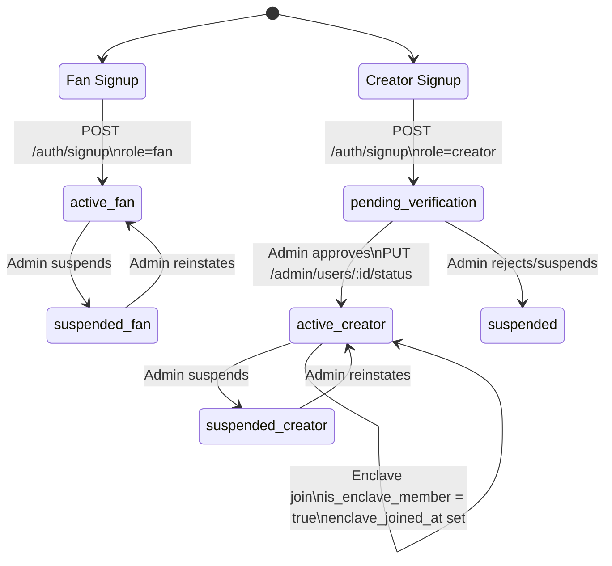

### Service-Layer Status Checks (not route guards)

| Service / Action | Status Required | Error if Blocked |
|---|---|---|
| `sendDirectMessage` | `creator.status === 'active'` | 403 `account must be verified to send messages` |
| `sendMassMessage` | `creator.status === 'active'` | 403 |
| `sendVoiceMessage` | `creator.status === 'active'` | 403 |
| Content creation (`createNewContent`) | None currently ⚠️ | Pending creators can upload |

### Enclave Sub-State (Creator only)
```
Trigger: Creator applies with referral code matching an Enclave invitation
OR: Admin sets is_enclave_member = true

Effect:
  - is_enclave_member = true
  - enclave_joined_at = timestamp
  - getEffectiveCommissionRate() → always returns ENCLAVE_COMMISSION_RATE (10%)
  - Admin cannot override commission rate for Enclave members
```

### Transition Table

| From | To | Trigger | Guard | Side Effect |
|---|---|---|---|---|
| *(start)* | `active` (fan) | `POST /auth/signup` `role=fan` | None | Profile created; session token issued |
| *(start)* | `pending verification` (creator) | `POST /auth/signup` `role=creator` | None | Profile created; Enclave check run; referral tracking started if code provided |
| `pending verification` | `active` (creator) | Admin `PUT /admin/users/:id/status` | `role === 'admin'` | Full creator API access enabled |
| `active` | `suspended` | Admin suspend | `role === 'admin'` | Login or API access restricted |
| `suspended` | `active` | Admin reinstate | `role === 'admin'` | Access restored |
| `active` (creator) | `active` + Enclave | Enclave application matched | Enclave code at signup OR admin action | `is_enclave_member = true`; `enclave_joined_at` set; commission locked at 10% |

### Test Coverage Gaps

| Gap | D4 Scenario | Risk |
|---|---|---|
| Creator signup → `pending verification` status | AUTH-005 ⬜ | High |
| Enclave signup → `is_enclave_member = true` | AUTH-015 ⬜ | High |
| Admin suspend/reinstate | ADM-003 ⬜ | Medium |
| Pending creator blocked from DM sending | MSG-005 ⬜ | High |

---

## 7. Smart Contract Recurring Allowance

### States

| State | `active` field | Description |
|---|---|---|
| *(non-existent)* | — | No `allowances[fan][creator]` mapping entry |
| Approved | `true` | Fan approved keeper to auto-bill up to `maxAmountPerPeriod` per `periodInSeconds` |
| Revoked | `false` | Fan revoked; keeper cannot process renewal |

### State Diagram

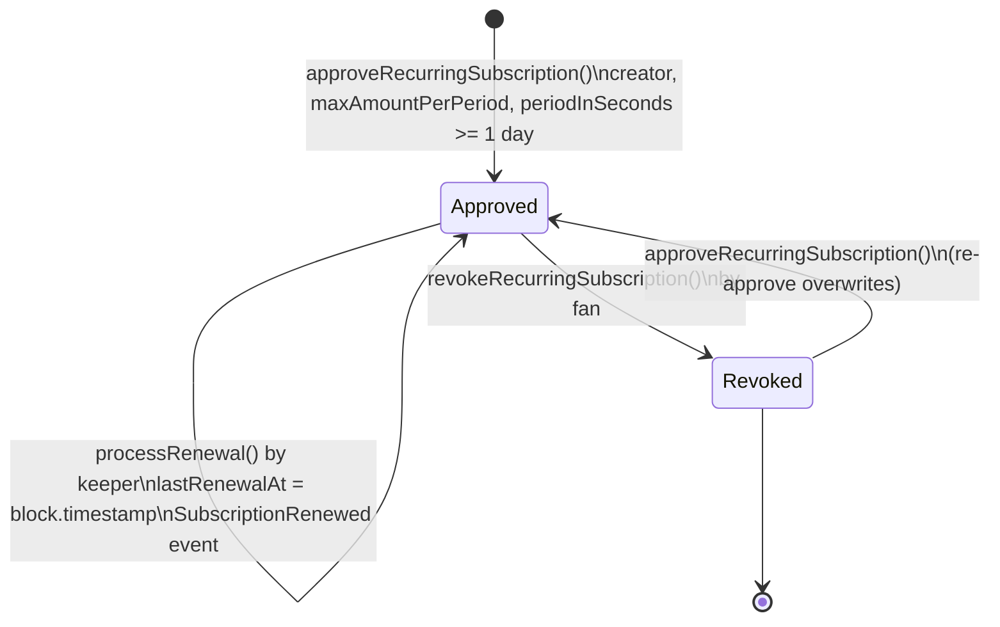

### `processRenewal` Guards
```solidity
require(allowance.active, "No active allowance");
require(amount > 0 && amount <= allowance.maxAmountPerPeriod, "Amount exceeds allowance");
require(
    block.timestamp >= allowance.lastRenewalAt + allowance.periodInSeconds,
    "Renewal period has not elapsed"
);
```

### Transition Table

| From | To | Trigger | Guard | Event Emitted |
|---|---|---|---|---|
| *(none)* | Approved | `approveRecurringSubscription(creator, max, period)` | `creator != address(0)`, `maxAmountPerPeriod > 0`, `periodInSeconds >= 1 days` | `SubscriptionApproved` |
| Approved | Approved | `processRenewal(token, fan, creator, amount, referrer, feeBps)` | `onlyKeeper`, `active=true`, `amount <= max`, `timestamp >= lastRenewalAt + period` | `SubscriptionRenewed` |
| Approved | Revoked | `revokeRecurringSubscription(creator)` | `active == true` | `SubscriptionRevoked` |
| Revoked | Approved | `approveRecurringSubscription(creator, max, period)` | Same as creation | `SubscriptionApproved` (overwrites) |

### Test Coverage Gaps

| Gap | D4 Scenario | Risk |
|---|---|---|
| `processRenewal` by non-keeper reverts | SOL-005 ⬜ | **Critical** — arbitrary billing by non-keeper |
| `processRenewal` before period elapsed | SOL-006 ⬜ | **Critical** — over-billing |
| `processRenewal` amount > allowance | SOL-007 ⬜ | **Critical** — overcharge |
| `approveRecurringSubscription` period < 1 day | SOL-013 ⬜ | High |
| `revokeRecurringSubscription` with no active allowance | SOL-014 ⬜ | Medium |

---

## 8. Notification Read State

### States
| State | `is_read` | Description |
|---|---|---|
| Unread | `false` | Newly created; counts toward unread total |
| Read | `true` | Marked read by user |
| Deleted | — | Removed from DB |

### State Diagram

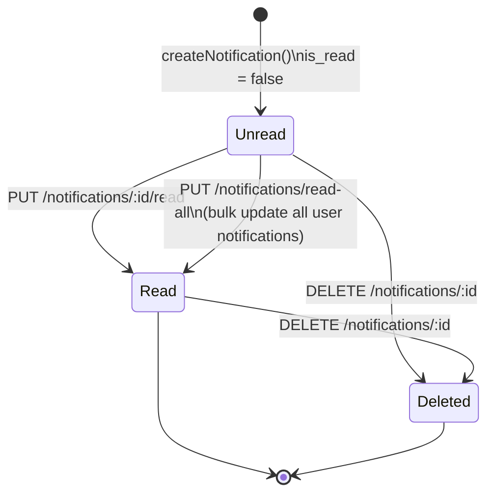

### Notification Creation Triggers

| Notification Type | Trigger | Recipient |
|---|---|---|
| `new_content` | Creator publishes content | All active subscribers with `preferences.notifications.newContent !== false` |
| `new_subscriber` | Audience subscribes to creator | Creator |
| `tip_received` | Tip tx verified `Cleared` | Creator |
| `ppv_unlocked` | PPV tx verified `Cleared` | Creator |
| `message_received` | DM sent | Recipient |
| `system` | Admin action | Target user |

### Preference Guard (new_content only)
```typescript
// notification.service.ts
const hasNotificationsEnabled =
    fanProfile?.preferences?.notifications?.newContent !== false;
// Default: true (opt-out model — enabled unless explicitly set false)
```

### Transition Table

| From | To | Trigger | Guard | Side Effect |
|---|---|---|---|---|
| *(start)* | `Unread` | System event (publish, subscribe, tip, PPV, DM) | Per-type condition (see above) | DB row inserted in `notifications` table |
| `Unread` | `Read` | `PUT /notifications/:id/read` | `protect` (own notification) | `is_read = true` |
| `Unread` | `Read` | `PUT /notifications/read-all` | `protect` | Bulk `is_read = true` for all user notifications |
| `Unread` / `Read` | `Deleted` | `DELETE /notifications/:id` | `protect` (own notification) | Row removed |

---

## 9. Referral — PERCENT Path

### States
| State | Description |
|---|---|
| `applied` | Creator used a PERCENT referral code at signup; tracking record created |
| `active` | Within 180-day window; 1% referral fee deducted from platform on every creator tx |
| `expired` | 180-day window elapsed; fee = 0, `getPercentageReferralInfo` returns null |

### State Diagram

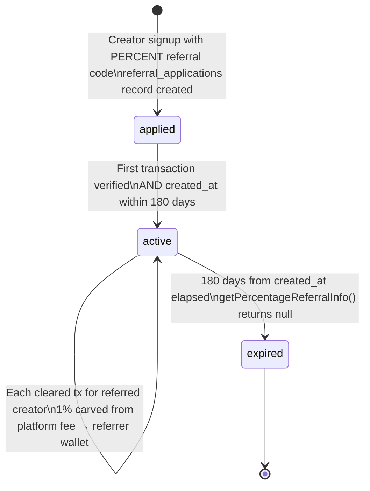

### Fee Calculation (active state)
```typescript
// referral.service.ts
referralFee = (grossAmountInCents * REFERRAL_FEE_BPS) / 10000  // REFERRAL_FEE_BPS = 100 → 1%
// Cap: referralFee must not exceed platformFee
if (referralFee > platformFee) referralFee = platformFee;
// Referrer must have a configured wallet; else fee = 0
if (!referrerWallet) referralFee = 0;
```

### Transition Table

| From | To | Trigger | Guard | Side Effect |
|---|---|---|---|---|
| *(none)* | `applied` | Creator signs up with valid PERCENT code | Code exists, creator role | `referral_applications` row created; `referrer_id` recorded |
| `applied` / `active` | `active` | Any cleared tx for referred creator | `created_at + 180 days >= NOW()` AND referrer has wallet | 1% fee deducted from platform share; paid to referrer wallet on-chain |
| `active` | `expired` | `getPercentageReferralInfo()` called after 180 days | `created_at + 180 days < NOW()` | Returns null; fee = 0 from that point |

---

## 10. Referral — CASH Path

### States
| State | Description |
|---|---|
| `tracking` | Referred creator is earning; cumulative earnings tracked toward $750 threshold |
| `milestone_reached` | Referred creator hit $750 within 30 days; bonus awarded |
| `speed_bonus` | Milestone hit within 14 days; additional $25 speed bonus on top of base $50 |
| `expired` | 30-day window elapsed without hitting $750; no bonus |

### State Diagram

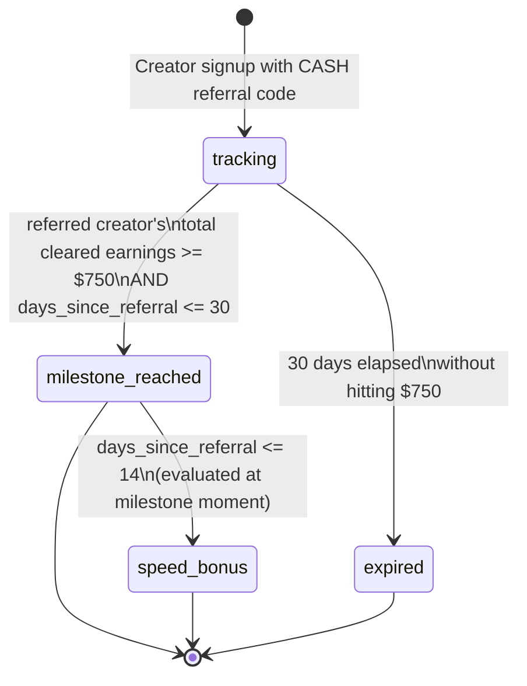

### Bonus Calculation
```
Milestone threshold:  $750 gross earnings by referred creator
Window:               30 days from referral application date

Base bonus:           $50 (ReferralBonus transaction created for referrer)
Speed bonus:          +$25 additional if milestone hit within 14 days
Total (speed):        $75

After 30 days with no milestone: no bonus, referral tracking ends
```

### Transition Table

| From | To | Trigger | Guard | Side Effect |
|---|---|---|---|---|
| *(none)* | `tracking` | Creator signup with CASH code | Code exists; creator role | Referral record created; `total_earnings = 0`; 30-day clock starts |
| `tracking` | `tracking` | Cleared tx for referred creator | Earnings < $750, within 30 days | Cumulative earnings incremented |
| `tracking` | `milestone_reached` | Cleared tx pushes earnings ≥ $750 | Within 30-day window | `$50` `ReferralBonus` transaction created for referrer |
| `milestone_reached` | `speed_bonus` | Same tx that triggered milestone | `days_since_referral <= 14` | Additional `$25` `ReferralBonus` transaction created |
| `tracking` | `expired` | 30-day check fails | `days_since_referral > 30` | No bonus; referral closed |

### Test Coverage Gaps

| Gap | D4 Scenario | Risk |
|---|---|---|
| $750 hit within 30 days → $50 bonus | REF-006 ⬜ | High |
| $750 hit within 14 days → $75 total | REF-007 ⬜ | High |
| $750 NOT hit within 30 days → no bonus | REF-008 ⬜ | Medium |

---

## 11. Message Content Unlock

### States
| State | `isUnlocked` | Description |
|---|---|---|
| `locked` | `false` | PPV content attached; Audience cannot view media |
| `unlocked` | `true` | Payment cleared; media accessible |
| `free_auto_unlocked` | `true` | Content price = 0; auto-unlocked at send time |

### State Diagram

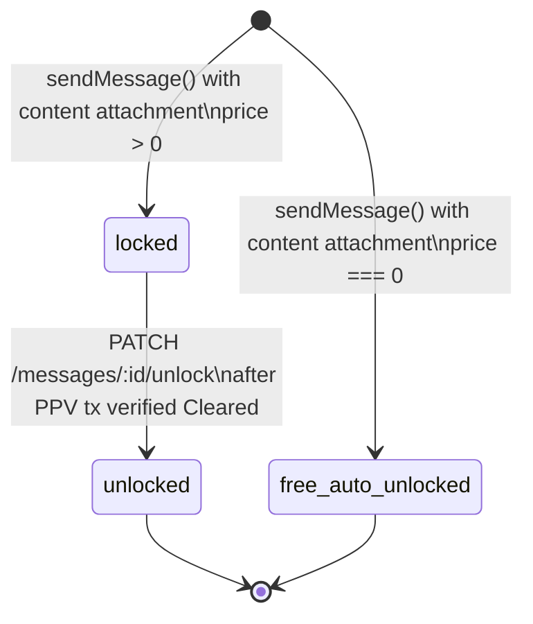

### Unlock Verification
```
PATCH /messages/:id/unlock
  → verifyAndRecordBasePayment() must return Cleared
  → Transaction type must be 'PPV Message' (not 'PPV Post')
  → MessageModel.unlockContentInMessage(messageId) → isUnlocked = true in DB
  → Socket.IO emits 'message_updated' to conversation room
```

### In-Gallery Enrichment (read-time)
```typescript
// message.service.ts → getMessagesForConversation()
// For fan (receiver_id):
isInGallery = galleryData.content.some(
    item => item.contentId === message.content.contentId
            || item.contentId === parseInt(message.content.contentId)
);
processedContent.inGallery = isInGallery;
```
This is not a state machine — it is computed at read time from the gallery snapshot.

### Transition Table

| From | To | Trigger | Guard | Side Effect |
|---|---|---|---|---|
| *(start)* | `locked` | `sendDirectMessage()` with `content.price > 0` | Creator `status === 'active'`; content exists | `content.creatorWalletAddress` injected; thumbnail URL generated and signed |
| *(start)* | `free_auto_unlocked` | `sendDirectMessage()` with `content.price === 0` | Same | `isUnlocked = true` at creation |
| `locked` | `unlocked` | `PATCH /messages/:id/unlock` with cleared tx | `protect`; tx type = `'PPV Message'`; tx `status = 'Cleared'` | `MessageModel.unlockContentInMessage()` persists; Socket.IO `message_updated` broadcast |

### Test Coverage Gaps

| Gap | D4 Scenario | Risk |
|---|---|---|
| `PATCH /unlock` persists to DB + fires Socket.IO | MSG-009 ⬜ | High |
| Unlock requires `PPV Message` type (not `PPV Post`) | MSG-010 ⬜ | High |
| `price = 0` auto-unlocks at send | MSG-007 ⬜ | Medium |

---

## Consolidated Test Gap Summary

| State Machine | Total Transitions | Covered (✅) | Untested (⬜) | Highest Risk Gap |
|---|---|---|---|---|
| Transaction Verification | 5 | 1 | 11 | Wrong creator wallet (PAY-007) |
| Subscription Lifecycle | 6 | 2 | 4 | Renewal eligibility filter (SUB-005) |
| Content Moderation | 7 | 1 | 4 | Auto-flag at 3 reports (CON-011) |
| Content Report | 2 | 0 | 2 | Bulk dismiss on admin approve (CON-012) |
| Contest Lifecycle | 6 | 0 | 7 | Winner by wrong creator (CNT-011) |
| User Account Status | 6 | 1 | 4 | Pending creator service blocks (AUTH-005) |
| SC Recurring Allowance | 5 | 0 | 5 | processRenewal by non-keeper (SOL-005) |
| Notification Read State | 4 | 0 | 3 | Opt-out preference guard (NOT-002) |
| Referral PERCENT | 3 | 0 | 2 | 180-day expiry (REF-005) |
| Referral CASH | 4 | 0 | 3 | Speed bonus at 14 days (REF-007) |
| Message Unlock | 3 | 0 | 3 | Socket.IO broadcast on unlock (MSG-009) |
| **Total** | **51** | **5** | **48** | |

> [!CAUTION]
> **48 of 51 state transitions have no automated test coverage.** The highest-severity unverified transitions are those guarding financial state: `processRenewal` by non-keeper (SOL-005), wrong creator wallet (PAY-007), duplicate tx hash (PAY-002), and the Enclave commission lock (ADM-004 — not a state machine but a business rule invariant).

---

*Status: Complete — All 11 state machines documented. Proceed to Deliverable 7 or execution phase.*
