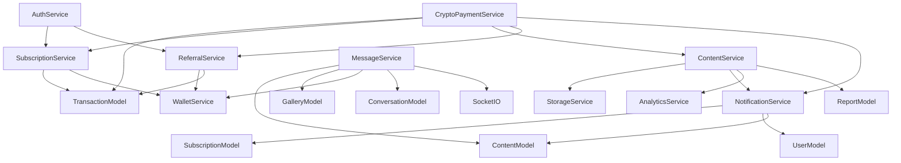

# Deliverable 7: Integration Test Matrix

**Project**: PoDM Creator-Audience Platform  
**Date**: August 9, 2026  
**Scope**: 8 integration boundaries, 68 integration test cases

---

## Boundary Index

| # | Boundary | Direction | Protocol | Critical? |
|---|---|---|---|---|
| [B1](#b1-frontend--backend-rest-api) | Frontend ↔ Backend REST API | Bidirectional | HTTP/HTTPS + Cookies | ✅ Yes |
| [B2](#b2-backend--supabase-database) | Backend ↔ Supabase Database | Backend → DB | Supabase JS client (PostgREST) | ✅ Yes |
| [B3](#b3-backend--supabase-auth) | Backend ↔ Supabase Auth | Backend → Auth | Supabase Admin SDK | ✅ Yes |
| [B4](#b4-backend--base-blockchain-rpc) | Backend ↔ Base Blockchain RPC | Backend → RPC | JSON-RPC over HTTPS | ✅ Yes |
| [B5](#b5-backend--cloudflare-r2-storage) | Backend ↔ Cloudflare R2 Storage | Bidirectional | S3-compatible API | High |
| [B6](#b6-backend--socketio) | Backend ↔ Socket.IO | Backend → Client | WebSocket | High |
| [B7](#b7-backend-services--each-other) | Backend Services ↔ Each Other | Internal | In-process function calls | High |
| [B8](#b8-smart-contract--erc-20-usdc) | Smart Contract ↔ ERC-20 USDC | On-chain | EVM `transferFrom` | ✅ Yes |
| [B9](#b9-backend--mediaprocessing-ffmpegsharp) | Backend ↔ Media Processing | Backend → Local | Node.js child process / Buffer | Medium |

---

## B1: Frontend ↔ Backend REST API

**Protocol**: HTTP with `authToken` + `authRefreshToken` HttpOnly cookies; `Bearer` token in header as fallback  
**Base URL**: Configured in frontend `apiClient`; `baseURL: https://podm.app/api/v1` (prod) or `http://localhost:3001/api/v1` (dev)

### Interface Contract

| Concern | Detail |
|---|---|
| Auth tokens | `authToken` (access) + `authRefreshToken` (refresh) — both HttpOnly cookies |
| 401 handling | Frontend `apiClient` intercepts 401 → `POST /auth/refresh` → retry original request |
| Error envelope | `{ success: false, message: string, error?: string }` |
| Success envelope | `{ success: true, data: T }` |
| Content-Type | `application/json`; multipart for file uploads |

### Test Cases

| ID | Test | Method | Endpoint | Expected Outcome | Status |
|---|---|---|---|---|---|
| B1-01 | Valid auth cookie → request passes `protect` | GET | `/users/me` | 200 + user object | ✅ |
| B1-02 | No cookie, no Authorization header → 401 | GET | `/users/me` | 401 `Not authorized, no token provided` | ✅ |
| B1-03 | Expired `authToken`, valid `authRefreshToken` → interceptor refreshes and retries | GET | `/users/me` | Transparent retry → 200 | ⬜ |
| B1-04 | Both tokens expired → interceptor refresh fails → redirect to `/login` | GET | `/users/me` | 401 propagated to UI | ⬜ |
| B1-05 | `POST /auth/refresh` with valid cookie → new `authToken` set in response `Set-Cookie` | POST | `/auth/refresh` | 200, new cookies present | ⬜ |
| B1-06 | `POST /auth/refresh` with missing cookie → 401 | POST | `/auth/refresh` | 401 `No refresh token provided` | ✅ |
| B1-07 | File upload > 10MB → rejected before reaching controller | POST | `/content` | 413 or express body limit error | ⬜ |
| B1-08 | CORS: cross-origin request from non-allowlisted origin → blocked | Any | Any | No `Access-Control-Allow-Origin` match | ⬜ |
| B1-09 | `X-Impersonating-User-Id` from non-admin → silently ignored | GET | `/content/my-content` | 403 (creator route, requester is fan) | ⬜ |
| B1-10 | `X-Impersonating-User-Id` valid creator ID from admin → creator routes accessible | GET | `/content/my-content` | 200, target creator's content | ⬜ |

### Failure Mode Map

| Failure | Observed Behavior | Test |
|---|---|---|
| Supabase Auth down | `protect` catches error → 401 `Not authorized: <authError.message>` | ⬜ |
| DB profile not found for valid token | 404 `User profile not found for this token` | ⬜ |
| Network timeout on API call | Frontend shows uncaught error (no retry for non-401) | ⬜ |

---

## B2: Backend ↔ Supabase Database

**Client**: `supabase-js` admin client (`supabaseClient.ts`)  
**Pattern**: All DB access via model layer (`server/models/*.ts`) using `handleQuery` / `handleList` / `handleCount` utilities

### Interface Contract

```typescript
// handleQuery wraps: supabase.from(table).select/insert/update/delete
// Returns: T | null  (never throws — errors are logged and null returned)

// handleList wraps same, returns: T[] | null
// handleCount wraps .select('*', { count: 'exact', head: true }), returns: number
```

> [!IMPORTANT]
> The model layer **never throws on DB errors** — it returns `null` and logs. Service layer must guard `if (!result) throw new AppError(...)`. Untested null-return paths can silently pass or produce 500s.

### Test Cases

| ID | Test | Table | Operation | Expected Outcome | Status |
|---|---|---|---|---|---|
| B2-01 | `createTransaction()` inserts row with all required fields | `transactions` | INSERT | Row returned with `id`, `status='Pending'` | ✅ (integration) |
| B2-02 | `updateTransactionStatus(txHash, 'Cleared')` targets by `blockchain_tx_hash` | `transactions` | UPDATE | Correct row updated; wrong hash untouched | ⬜ |
| B2-03 | `findSubscriptionsDueForRenewal()` respects `fan_wallet_address IS NOT NULL` filter | `subscriptions` | SELECT | Subs without wallet excluded | ⬜ |
| B2-04 | `findSubscriptionByFanAndCreator()` with `status='active'` — returns null if expired | `subscriptions` | SELECT | Null for expired sub | ⬜ |
| B2-05 | `createReport()` inserts with `status='pending'`; `getReportsByContentId()` returns all | `content_reports` | INSERT + SELECT | Count accurate across multiple reporters | ⬜ |
| B2-06 | `dismissReportsForContent()` bulk-updates all rows for `content_id` | `content_reports` | UPDATE | All `pending` → `dismissed`; other content_ids untouched | ⬜ |
| B2-07 | `addItemToGallery()` dedup: second insert of same `contentId` returns `added: false`, no UPDATE | `galleries` | SELECT + conditional UPDATE | UPDATE not called | ✅ |
| B2-08 | `findSuccessfulTransactionByFanAndContent()` uses `.in('type', ['PPV Post', 'PPV Message'])` | `transactions` | SELECT | Only PPV types returned, not Subscription | ✅ |
| B2-09 | `sumPlatformFeeForPeriod()` correctly filters by `status='Cleared'` and `created_at >= N days ago` | `transactions` | SELECT + aggregate | Pending/Failed excluded from sum | ⬜ |
| B2-10 | `countTotalActiveSubscribersAtDate()` uses `end_date IS NULL OR end_date > date` | `subscriptions` | SELECT + count | Historical count accurate | ⬜ |
| B2-11 | Row-level security: fan cannot read another fan's gallery via direct Supabase query | `galleries` | SELECT | RLS blocks cross-user access | ⬜ |
| B2-12 | `handleQuery` DB error → returns null; service throws AppError | Any | Any | Null propagated; service-layer error raised | ⬜ |

### High-Risk Null-Return Paths (service must guard)

| Service Call | If Null Returned | Risk |
|---|---|---|
| `findSubscriptionByFanAndCreator()` | Access control bypassed (content served to unsubscribed fan) | Critical |
| `findSuccessfulTransactionByFanAndContent()` | PPV content served without payment | Critical |
| `createTransaction()` | Payment recorded in Pending state; no tx ID for follow-up | High |
| `findUserById()` in `protect` | 404 returned; user cannot auth | Medium |

---

## B3: Backend ↔ Supabase Auth

**SDK Call**: `supabase.auth.getUser(token)` — validates JWT and returns auth user  
**Admin call**: `supabase.auth.admin.deleteUser(userId)` — orphan cleanup on failed `signupAndSubscribe`

### Test Cases

| ID | Test | Expected Outcome | Status |
|---|---|---|---|
| B3-01 | Valid Supabase JWT → `authUser.id` returned, `findUserById(id)` resolves | 200, `req.user` set | ✅ |
| B3-02 | Tampered JWT signature → `authError` returned → 401 `Not authorized: <message>` | 401 | ✅ |
| B3-03 | Expired JWT → `authError` returned → 401 | 401 | ⬜ |
| B3-04 | Supabase Auth service unavailable → `authError` thrown → 401 | 401, no 500 | ⬜ |
| B3-05 | `signupAndSubscribe`: subscription step throws → `supabase.auth.admin.deleteUser(userId)` called | Auth user deleted | ⬜ |
| B3-06 | `signupAndSubscribe`: `admin.deleteUser` itself fails → error logged, original error re-thrown | No silent swallow | ⬜ |
| B3-07 | Auth user exists in Supabase but no matching `profiles` row → 404 `User profile not found` | 404 | ⬜ |

### Orphan Cleanup Contract (signupAndSubscribe)
```typescript
// auth.service.ts
try {
    const { user } = await supabase.auth.signUp({ email, password });
    await createProfileAndSubscribe(user.id, ...);
} catch (err) {
    await supabase.auth.admin.deleteUser(user.id);  // cleanup
    throw err;
}
```
**Risk**: If `admin.deleteUser` fails (permissions, network), the auth user persists as an orphan with no profile. The service should log this clearly. No test covers this path.

---

## B4: Backend ↔ Base Blockchain RPC

**Protocol**: JSON-RPC 2.0 via `axios.post(RPC_URL, { method: 'eth_getTransactionReceipt', ... })`  
**Network**: Base mainnet (chain ID 8453)  
**Contract**: `0xa8f480...` (PoDMPaymentProtocol UUPS proxy)

### Interface Contract

```
Request:  POST <BASE_RPC_URL>
Body:     { jsonrpc: "2.0", method: "eth_getTransactionReceipt", params: [txHash], id: 1 }

Response (found):   { result: { status, logs: [...], to, ... } }
Response (pending): { result: null }
Response (error):   { error: { code, message } }
```

### Event Log Parsing Contract

```
SubscriptionPaid / TipPaid / PPVPaid events
  log.address === BASE_CONTRACT_ADDRESS  (case-insensitive)
  log.topics[0] === keccak256("SubscriptionPaid(...)") or TipPaid / PPVPaid
  log.topics[2] === 0x000...{creatorWalletAddress}  (padded 32 bytes)
  log.data → ABI-decoded: [totalAmount, platformFee, referralFee, creatorAmount, referrerAddress]
```

### Test Cases

| ID | Test | Scenario | Expected Outcome | Status |
|---|---|---|---|---|
| B4-01 | RPC returns valid receipt with `status='0x1'` and PoDM log | Happy path | tx Cleared | ✅ (integration) |
| B4-02 | RPC returns `{ result: null }` (pending) — 5 sync retries | Timeout path | 404 after 5×3s | ⬜ |
| B4-03 | RPC returns `{ result: null }` — 10 async retries | Background timeout | tx → Failed | ⬜ |
| B4-04 | RPC returns `{ result: { status: '0x0' } }` | Reverted tx | 400 `Transaction failed on the blockchain` | ⬜ |
| B4-05 | Receipt `logs` contains no entry with PoDM contract address | Wrong contract | 400 `not the PoDM smart contract` | ⬜ |
| B4-06 | Receipt `to` = EntryPoint address; `logs` contain PoDM entry (ERC-4337) | Gasless UserOp | Not rejected; proceeds to validation | ⬜ |
| B4-07 | `topics[2]` decoded ≠ creator's configured wallet | Creator mismatch | 400 `recipient does not match` | ⬜ |
| B4-08 | Decoded `totalAmount` differs from requested amount by > 1 cent | Amount mismatch | 400 `amount mismatch` | ⬜ |
| B4-09 | Decoded `referrer` ≠ `address(0)` when creator has no active referral | Unexpected referrer | 400 `unexpected referrer` | ⬜ |
| B4-10 | Decoded `referrer` ≠ DB-resolved referrer wallet | Referrer mismatch | 400 `referrer does not match` | ⬜ |
| B4-11 | Decoded `referralFee` differs from expected by > 2 cents | Fee mismatch | 400 `Referral fee mismatch` | ⬜ |
| B4-12 | `BASE_RPC_URL` env var not set → service throws at startup | Misconfiguration | 500 with meaningful error | ⬜ |
| B4-13 | `BASE_CONTRACT_ADDRESS` env var not set → verification throws | Misconfiguration | 500 `PoDM smart contract address not configured` | ⬜ |
| B4-14 | RPC timeout / network error on all sync attempts | Network failure | 404 (not 500) | ⬜ |
| B4-15 | Hash normalization: non-standard hex input → padded to 64-char buffer | Hash format | Proceeds to RPC call | ⬜ |

### Retry Configuration

| Path | MAX_ATTEMPTS | DELAY | Final Action |
|---|---|---|---|
| Sync (user-facing) | 5 | 3,000ms | Return 404; record stays `Pending` |
| Async (background) | 10 | 6,000ms | `updateTransactionStatus(hash, 'Failed')` |

> [!CAUTION]
> B4-06 (ERC-4337 UserOp) is a live production scenario — users paying via Coinbase Smart Wallet use the EntryPoint. If `receipt.to` is checked against the PoDM contract address (instead of `logs`), **all gasless payments silently fail verification**. This is the highest-severity untested integration point.

---

## B5: Backend ↔ Cloudflare R2 Storage

**Pattern**: `StorageService` wraps R2 S3-compatible API  
**Buckets**: Private bucket (content files + thumbnails + temp watermarks)  
**Key format**: `{creator_id}/{timestamp}-{filename}` (originals), `{creator_id}/thumb-{filename}.webp` (thumbnails), `temp/wm-{fan_id}-{timestamp}.webp` (watermarks)

### Test Cases

| ID | Test | Operation | Expected Outcome | Status |
|---|---|---|---|---|
| B5-01 | `uploadToPrivate(path, buffer, mimeType)` → file accessible by key | Upload | No error; key retrievable | ⬜ |
| B5-02 | `uploadToPrivate` fails → `deleteFromPrivate(paths)` called for all already-uploaded files in batch | Upload failure cleanup | All partial uploads deleted | ⬜ |
| B5-03 | `downloadFromPrivate(path)` → returns `{ buffer, error }` | Download | Buffer matches uploaded content | ⬜ |
| B5-04 | `downloadFromPrivate` for non-existent key → `error` returned, `buffer = null` | Miss | Service falls back gracefully | ⬜ |
| B5-05 | Signed URL generation for subscriber content → URL expires in configured TTL | Signed URL | URL valid within TTL, expired after | ⬜ |
| B5-06 | Temp watermark upload to `temp/` prefix → 5-min TTL key accessible | Watermark upload | Key accessible; not permanent | ⬜ |
| B5-07 | R2 endpoint unreachable → upload returns `{ error }` → `AppError(500)` thrown | Storage outage | 500 with message, no hang | ⬜ |
| B5-08 | FFmpeg thumbnail written to `os.tmpdir()` then uploaded → temp file deleted from disk after upload | Temp cleanup | `os.tmpdir()` file absent after success | ⬜ |
| B5-09 | FFmpeg temp file cleanup fails (ENOENT) → error logged, no re-throw | Cleanup error | Operation proceeds; error logged | ⬜ |

---

## B6: Backend ↔ Socket.IO

**Setup**: Socket.IO server initialized in `server/config/socket.ts`; `io` exported and used in services  
**Rooms**: `conversation:<conversationId>` — both sender and receiver join on connection  
**Events emitted by server**:

| Event | Payload | Trigger |
|---|---|---|
| `new_message` | Full message object with signed URLs | `sendDirectMessage()` |
| `message_updated` | Updated message with `isUnlocked: true` | `PATCH /messages/:id/unlock` |
| `notification` | Notification object | New notification created |

### Test Cases

| ID | Test | Event | Expected Outcome | Status |
|---|---|---|---|---|
| B6-01 | `sendDirectMessage()` emits `new_message` to `conversation:<id>` room | `new_message` | Both participants receive in real-time | ⬜ |
| B6-02 | `PATCH /messages/:id/unlock` emits `message_updated` with `isUnlocked: true` | `message_updated` | Recipient receives updated content without reload | ⬜ |
| B6-03 | Recipient not connected (offline) → message stored in DB; delivered on reconnect via history fetch | `new_message` (offline) | DB persisted; no Socket.IO error | ⬜ |
| B6-04 | `io.to(room).emit()` called with non-existent room → no error thrown; operation silent | Invalid room | Service completes; no 500 | ⬜ |
| B6-05 | Socket.IO disconnects mid-operation → `emit` silently fails; DB state still consistent | Disconnect | DB write committed before emit | ⬜ |
| B6-06 | Mass message to 1000 subscribers → all Socket.IO emits complete without blocking HTTP response | `new_message` × N | HTTP response returns before all emits complete | ⬜ |

> [!NOTE]
> Socket.IO emit is fire-and-forget — errors in `io.to().emit()` do not propagate to the HTTP response. DB state must be committed before emit. Tests should mock `io` and verify it is called with the correct room and payload.

---

## B7: Backend Services ↔ Each Other

This boundary documents **in-process cross-service calls** — the most complex integration layer because failures propagate silently unless each caller checks for null/error returns.

### Dependency Graph



### Test Cases

| ID | Caller | Callee | Integration Point | Failure Mode | Status |
|---|---|---|---|---|---|
| B7-01 | `CryptoPaymentService` | `ReferralService.calculateReferralFee()` | Called before tx verification; referral fee encoded in expected amounts | Referrer wallet null → fee = 0 (not treasury address) | ⬜ |
| B7-02 | `CryptoPaymentService` | `NotificationService.notify*()` | Called after tx Cleared | Notification service throws → payment still recorded as Cleared (no rollback) | ⬜ |
| B7-03 | `CryptoPaymentService` | `ContentService.incrementContentPpvEarningsStats()` | Called on PPV Cleared | Stats service throws → payment Cleared; stats not updated | ⬜ |
| B7-04 | `ContentService` | `NotificationService.notifySubscribersOfNewContent()` | Called on content publish | No subscribers → returns early; no error | ✅ |
| B7-05 | `ContentService` | `StorageService.uploadToPrivate()` | Per-file in batch | One file fails → `deleteFromPrivate(allPaths)` called; error thrown | ⬜ |
| B7-06 | `MessageService` | `ContentModel.findContentById()` | On message with attached content | Content deleted → 404 `Attached content could not be found` | ⬜ |
| B7-07 | `MessageService` | `WalletService.getCryptoWalletForUser()` | Creator wallet injected into message payload | Wallet not configured → `''` injected (not treasury) | ⬜ |
| B7-08 | `MessageService` | `GalleryModel.addItemToGallery()` | On bookmark action from message | Duplicate contentId → `added: false`; gallery stat NOT incremented | ✅ |
| B7-09 | `AuthService` | `SubscriptionService.createSubscriptionForUser()` | In `signupAndSubscribe` | Subscription fails → `supabase.auth.admin.deleteUser()` called | ⬜ |
| B7-10 | `AuthService` | `ReferralService.awardReferralBonus()` | At creator signup with referral code | Referral code invalid → signup proceeds; no referral created | ⬜ |
| B7-11 | `NotificationService` | `SubscriptionModel.findSubscriptionsByCreator()` | Fetch subscriber list for notification fan-out | No subscriptions → returns early; no error | ✅ |
| B7-12 | `NotificationService` | `supabase.from('profiles').select('preferences')` | Per-subscriber preference check | Profile missing `preferences` key → `hasNotificationsEnabled` defaults to `true` | ⬜ |
| B7-13 | `ReferralService` | `WalletService.getReferrerWalletForCreator()` | Resolve referrer wallet for fee payment | Referrer has no wallet → `''`; fee not included in tx | ⬜ |
| B7-14 | `SubscriptionService` | `TransactionModel.findClearedSubscriptionByTxHash()` | Idempotency check on re-verify | Hash already Cleared → 409 (no duplicate subscription) | ⬜ |
| B7-15 | `CryptoPaymentService` | `AnalyticsService.incrementContentTipStats()` | On tip tx Cleared with `relatedId` | `relatedId` absent → stats not updated; no throw | ⬜ |

### Critical Cross-Service Invariants

| Invariant | Enforced By | Tested? |
|---|---|---|
| Referral fee never reduces creator payout | `_computeFeeSplit` in contract; `calculateReferralFee` in service | ⬜ (B7-01) |
| No treasury fallback for wallet | `getCryptoWalletForUser` returns `''` when null | ⬜ (B7-07) |
| Payment Cleared before notification | Service call order in `cryptoPayment.service.ts` | ⬜ (B7-02) |
| Orphan auth user deleted on failed signup | `signupAndSubscribe` catch block | ⬜ (B7-09) |

---

## B8: Smart Contract ↔ ERC-20 USDC

**Token**: USDC on Base mainnet (`0x833589...`)  
**Method**: `IERC20.transferFrom(fan, recipient, amount)` — requires prior `approve(contractAddress, amount)`

### Transfer Flow Per Payment Type

```
paySubscription / payTip / payPPV:
  1. transferFrom(fan, platformTreasury, treasuryFee)     ← if fails: revert "Platform fee transfer failed"
  2. transferFrom(fan, creator, creatorAmount)            ← if fails: revert "Creator payout transfer failed"
  3. if referralFee > 0:
       transferFrom(fan, referrer, referralFee)           ← if fails: revert "Referrer payout transfer failed"

processRenewal (keeper):
  1. transferFrom(fan, platformTreasury, treasuryFee)
  2. transferFrom(fan, creator, creatorAmount)
  3. if referralFee > 0:
       transferFrom(fan, referrer, referralFee)
```

### Test Cases

| ID | Test | Scenario | Expected Outcome | Status |
|---|---|---|---|---|
| B8-01 | Fan has sufficient USDC + approval → all 3 transfers succeed | Happy path | Balances updated; event emitted | ⬜ |
| B8-02 | Fan has insufficient USDC → `transferFrom` reverts | Insufficient balance | Entire tx reverts; no partial transfer | ⬜ |
| B8-03 | Fan approved less than required amount → `transferFrom` reverts | Insufficient allowance | Revert "ERC20: transfer amount exceeds allowance" | ⬜ |
| B8-04 | Platform treasury address is `address(0)` → `initialize` reverts | Misconfiguration | Deploy-time revert | ⬜ |
| B8-05 | Creator address is `address(0)` in `paySubscription` | Invalid creator | Revert "Invalid creator address" | ⬜ |
| B8-06 | Amount is 0 in `paySubscription` | Zero amount | Revert "Amount must be greater than zero" | ⬜ |
| B8-07 | `referralFee` computed > `platformFee` → capped at `platformFee` → treasury gets 0, referrer gets capped fee | Fee cap | No revert; treasuryFee = 0; referrer = capped | ⬜ |
| B8-08 | Contract paused → `paySubscription` reverts | Paused state | Revert from `whenNotPaused` | ⬜ |
| B8-09 | Reentrancy attempt via malicious ERC-20 callback → blocked by `nonReentrant` | Reentrancy | Revert | ⬜ |
| B8-10 | `processRenewal` with stale `lastRenewalAt` just under period boundary | Edge timing | Revert "Renewal period has not elapsed" | ⬜ |

---

## B9: Backend ↔ Media Processing (FFmpeg / Sharp)

**Sharp**: Image thumbnail generation + watermark compositing (in-process, Node.js)  
**FFmpeg**: Video thumbnail extraction (child process via `fluent-ffmpeg`; writes to `os.tmpdir()`)

### Test Cases

| ID | Test | Library | Scenario | Expected Outcome | Status |
|---|---|---|---|---|---|
| B9-01 | Image upload → Sharp resizes to 400×400 WebP thumbnail → uploaded to R2 | Sharp | Happy path | Thumbnail key stored in `files[0].thumbnailUrl` | ⬜ |
| B9-02 | Sharp thumbnail upload fails → fallback to original path as thumbnail | Sharp | Upload error | `thumbnailUrl = filePath` (no throw) | ⬜ |
| B9-03 | Watermark SVG contains `<`, `>`, `&`, `"` in username → XML-escaped before Sharp composite | Sharp | XSS/injection | Escaped correctly; image generated | ⬜ |
| B9-04 | Watermarked image uploaded to `temp/wm-{fanId}-{ts}.webp` in R2 → accessible for TTL | Sharp | Watermark path | Key exists in R2; different from original | ⬜ |
| B9-05 | Watermark download from R2 fails → falls back to original (unwatermarked) file path | Sharp | Download error | Original path returned; no 500 | ⬜ |
| B9-06 | Video upload → FFmpeg extracts frame at `00:00:01.000` → JPEG uploaded to R2 | FFmpeg | Happy path | Thumbnail key stored; temp files absent from disk | ⬜ |
| B9-07 | FFmpeg binary path missing (`ffmpegPath` env not matching) → `AppError(500)` | FFmpeg | Path error | 500 `Could not generate video thumbnail` | ⬜ |
| B9-08 | FFmpeg temp video file (`os.tmpdir()`) cleaned up after thumbnail upload | FFmpeg | Cleanup | `fs.unlink` called for both `tempVideoPath` and `tempThumbPath` | ⬜ |
| B9-09 | FFmpeg cleanup fails (ENOENT) → error logged only; content upload not affected | FFmpeg | Cleanup error | No re-throw; content created successfully | ⬜ |
| B9-10 | Audio file upload → neither Sharp nor FFmpeg invoked; original path used as thumbnail | Both | Audio fallback | `thumbnailUrl = filePath`; no processing attempted | ⬜ |

> [!NOTE]
> FFmpeg path is hardcoded to a WinGet install path in `content.service.ts`. This must be configurable via env var for CI/CD environments (Linux containers). Tests must mock `fluent-ffmpeg` rather than invoking the real binary.

---

## Cross-Boundary Risk Matrix

Ranked by probability × severity of failure going undetected:

| Rank | Boundary | Integration Point | Severity | Tested? |
|---|---|---|---|---|
| 1 | B4 | ERC-4337 UserOp — `receipt.to` = EntryPoint; PoDM logs in `logs[]` | **Critical** | ⬜ |
| 2 | B4 | Wrong creator wallet decoded from log `topics[2]` | **Critical** | ⬜ |
| 3 | B7 | `getCryptoWalletForUser` returns `''` (no treasury fallback) | **Critical** | ⬜ |
| 4 | B3 | `signupAndSubscribe` orphan cleanup on subscription failure | **Critical** | ⬜ |
| 5 | B4 | Duplicate `blockchain_tx_hash` → double-credit | **Critical** | ⬜ |
| 6 | B7 | Referral fee doesn't reduce creator payout (service + contract agree) | High | ⬜ |
| 7 | B2 | `findSubscriptionsDueForRenewal` includes subs without wallet | High | ⬜ |
| 8 | B6 | Socket.IO `message_updated` fires after `PATCH /unlock` | High | ⬜ |
| 9 | B5 | Partial batch upload failure → cleanup of already-uploaded files | High | ⬜ |
| 10 | B9 | FFmpeg temp file not cleaned up → `os.tmpdir()` accumulates | Medium | ⬜ |

---

## Test Infrastructure Requirements

### Mocks Required

| External System | Mock Strategy | Purpose |
|---|---|---|
| Supabase DB | `jest.mock('../config/supabaseClient')` with chainable mock builders | Isolate model layer |
| Supabase Auth | Mock `supabase.auth.getUser()` return value | Auth flow unit tests |
| Base RPC | Mock `axios.post` to return synthetic receipts | Payment verification |
| Cloudflare R2 | Mock `StorageService.uploadToPrivate / downloadFromPrivate` | Content service tests |
| Socket.IO | Mock `io.to().emit()` via jest.spyOn | Real-time event tests |
| FFmpeg | Mock `fluent-ffmpeg` module | Video thumbnail tests |
| Sharp | Mock `sharp()` chain | Image processing tests |

### Real Integration Tests (require live env)

| Test | Env Required | Notes |
|---|---|---|
| B4 happy path (real RPC call) | Base RPC URL + test tx hash | Slow; use sparingly |
| B8 full USDC transfer flow | Hardhat local fork of Base | Use `hardhat mainnet-fork` |
| B5 R2 upload/download | Cloudflare R2 test bucket | CI secret required |
| B2 RLS enforcement | Real Supabase project | Use test project; RLS policy validation |

### Recommended Test Commands

```bash
# Backend unit + integration (mocked externals)
cd PoDM_project && npm test

# Smart contract integration (local fork)
cd PoDM_project/contracts
npx hardhat test --network hardhat

# Frontend E2E (requires running backend + staging DB)
cd podm-frontend
npx playwright test --project=chromium
```

---

## Coverage Summary

| Boundary | Total Cases | ✅ Covered | ⬜ New Required |
|---|---|---|---|
| B1 — Frontend ↔ API | 10 | 2 | 8 |
| B2 — Backend ↔ DB | 12 | 3 | 9 |
| B3 — Backend ↔ Supabase Auth | 7 | 2 | 5 |
| B4 — Backend ↔ Blockchain RPC | 15 | 1 | 14 |
| B5 — Backend ↔ R2 Storage | 9 | 0 | 9 |
| B6 — Backend ↔ Socket.IO | 6 | 0 | 6 |
| B7 — Services ↔ Services | 15 | 3 | 12 |
| B8 — Contract ↔ ERC-20 | 10 | 0 | 10 |
| B9 — Backend ↔ FFmpeg/Sharp | 10 | 0 | 10 |
| **Total** | **94** | **11** | **83** |

> [!CAUTION]
> **83 of 94 integration test cases have no coverage.** The entire blockchain RPC boundary (B4), storage boundary (B5), real-time boundary (B6), and media processing boundary (B9) have **zero tests**. The blockchain boundary contains the platform's highest-severity risk: undetected payment fraud, double-crediting, and silent gasless payment failures.

---

*Status: Complete.*
